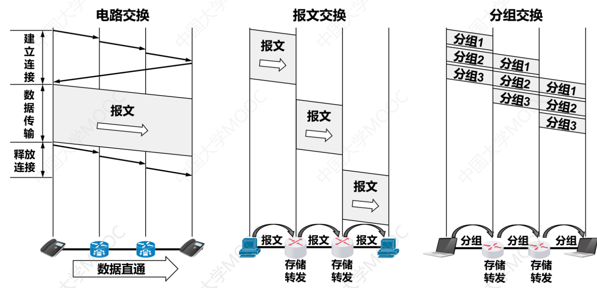

# 电路交换、报文交换、分组交换的性能分析

### **日期**: 2024 年 10 月 10 日

---

## 知识总览

### **注意（Figure1）**：纵轴向下表示时间 t 增加的方向。

### **本节重点在于将图看懂，看懂图就懂得根据图进行性能分析**

---

## **电路交换的性能分析**（参考 Figure1）

- ### **建立连接**：发送方主机向另一个接收方主机发送建立连接请求，接收方主机处理请求后返回响应的过程
  - **传播时延** ：图中**建立连接**部分和**释放连接**部分同一个箭头头尾的纵坐标差，可以理解为两个单位之间传递信号的时间
  - **电路交换机建立、释放下一跳连接耗时**： 图中**建立连接**和**释放连接**部分部分前一个箭头头部和后一个箭头尾部的纵坐标差，可以理解为电路交换机内部的连接时间
  - **接收方处理连接请求耗时**：图中建立连接部分返回的大箭头尾部和前一个箭头头部的纵坐标差
- ### **数据传输**：发送方主机向接收方主机发送数据的过程
  - **假设**：报文大小 = 4kb，数据传输速率 = 0.5kb/ms
  - **数据传输时间**：则报文所在平行四边形纵轴方向的长度即为（报文大小/传输速率）8ms
  - **传播时延**：报文所在平行四边形上边和下边各自的头尾纵坐标差即为三次传播总的传播时延
  - **报文传输时间**：整个平行四边形左上顶点和右下顶点的纵坐标差即为报文的传输时间，即总传播时延+数据传输时间
- ### **释放连接**：过程类似**建立连接**，但不必返回响应，可以在发送完最后 1bit 报文之后立马就发送释放请求（即连接释放部分第一个箭头尾部可以无限靠近报文平行四边形左下角点）

---

## **报文交换的性能分析**（参考 Figure1）

- ### **报文传输**：报文在节点间传输的时间，即图示平行四边形左上顶点和右下顶点的纵坐标差
- ### **报文存储转发时延**：报文在节点中存储和转发的时间，即图中两个平行四边形两个共线的边之间的空白时间
- ### **注意**：中间节点一定要接收完整个报文之后，才能解析并转发

---

## **分组交换的性能分析**（参考 Figure1）

- **分组传输**：分组在节点间传输的时间，即图示平行四边形左上顶点和右下顶点的纵坐标差
- **分组存储转发时延**：分组在节点中存储和转发的时间，即图中同一个分组所在的两个平行四边形两个共线的边之间的空白时间
- **注意**：中间节点一定要接收完整个分组之后，才能解析并转发

---

## **三种交换方式的性能对比**

|          比较维度          |              电路交换               | 报文交换 |          分组交换          |
| :------------------------: | :---------------------------------: | :------: | :------------------------: |
|      完成传输所需时间      | 最少（排除建立/ 释放连接的耗时） |   最多   |  较少 （比报文交换快）  |
|        存储转发时延        |                 无                  |   较高   |            较低            |
| 通信前是否 需要建立连接 |                 是                  |    否    |             否             |
|          缓存开销          |                 无                  |    大    |             小             |
|      是否支持差错控制      |               不支持                |   支持   |            支持            |
|  报文数据 是否有序到达  |                 是                  |    是    |             否             |
| 是否需要 额外的控制信息 |                 否                  |    是    | 是（控制信息 占比最大） |
|       线路分配灵活性       |               不灵活                | 比较灵活 |          高度灵活          |
|         线路利用率         |                 低                  |   较高   |           非常高           |
