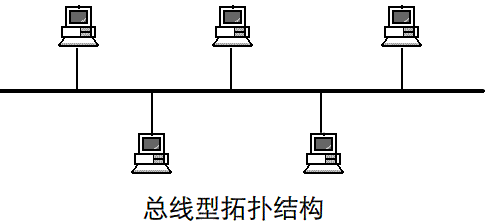
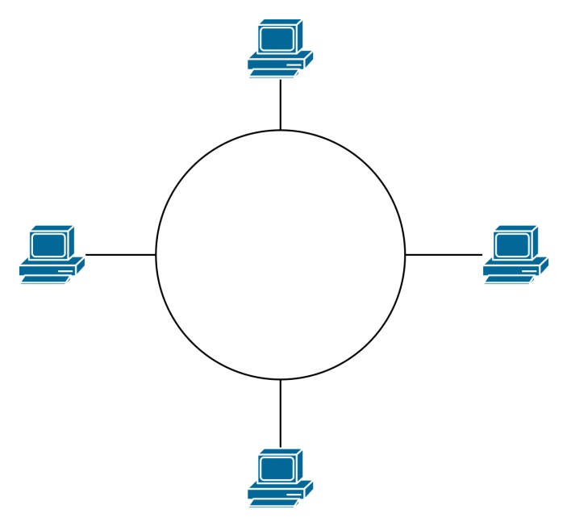
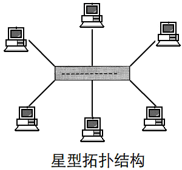
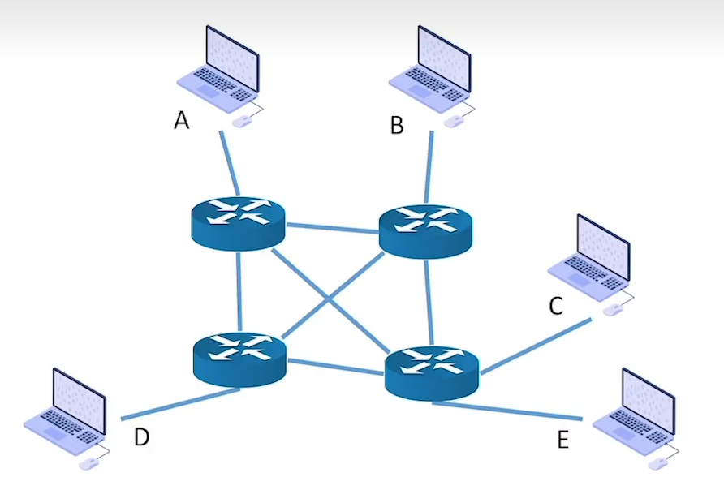

# 计算机网络的分类

### **日期**: 2024 年 10 月 14 日

---

## 知识总览

计算机网络的分类

- 按分布范围分类
  - **广域网**（WAN, Wide Area Network）
  - 城域网(MAN, Metropolitan Area Network)
  - **局域网**(LAN, Local Area Network)
  - 个域网(PAN, Personal Area Network)
- 按传输技术分类
  - 广播式网络
  - 点对点网络
- 按拓扑结构分类（物理和逻辑不同，我们主要探讨逻辑）
  - **总线型**
  - **环形**
  - **星形**
  - **网状**
- 按使用者分类
  - 公用网
  - 专用网
- 按传输介质分类
  - 有线网络
  - 无线网络

---

## **按分布范围分类**

- ### **广域网（WAN, Wide Area Network）**
  - **范围**：几十公里 ~ 几千公里
  - 跨省/跨国/跨州
- ### **城域网(MAN, Metropolitan Area Network)**
  - **范围**：几公里 ~ 几十公里
  - 一个或几个相邻城市
  - **通信技术**：常采用“**以太网技术**”，因此常并入局域网范畴探讨
- ### **局域网(LAN, Local Area Network)**
  - **范围**：几十米 ~ 几千米
  - 学校/企业/工作单位/家庭
  - **通信技术**：**以太网技术**
- ### **个域网(PAN, Personal Area Network)**
  - **范围**：几十米以内
  - 家庭/个人
  - **通信技术**：通常是通过无线技术将个人设备连接起来的网络，因此也常称为**无线个域网（WPAN）**
- **注**：如今几乎所有局域网都采用的是“以太网技术”，因此“**以太网**”几乎成了“**局域网**”的代名词
- ### **举例**
  - 广域网（WAN）、局域网（LAN）
    - 家用路由器 WAN 口连接广域网，LAN 口连接家庭主机
  - 个域网（PAN）
    - 蓝牙、ZigBee、Wi-Fi 设备等，以及网关（主设备）+智能家居（从设备）组成的个域网

---

## **按传输技术分类**

- ### **广播式网络**
  - 当一台计算机发送数据分组时，广播范围内所有计算机都会收到该分组，并通过**检查分组的目的地址**决定是否接收该分组
  - e.g. 所有无线网络都是“广播式”
- ### **点对点网络**
  - 数据只会从发送方“点对点”发到发送方，精准到达
  - e.g. 路由器（非家用路由器）转发的数据分组

---

## **按拓扑结构分类**

- ### **总线型结构**

  - 数据“**广播式**”传输：存在“**总线争用**”的问题
    
  - **实例**：通过集线器（Hub）构造的网络（物理上看是星形拓扑，但逻辑上是总线形）

- ### **环形结构**

  - 数据“**广播式**”传输，通过“令牌”解决总线争用问题，令牌顺环形依次传递，拿到令牌者可以使用总线
    
  - **实例**：令牌环网（流行于 2000 以前的一种局域网技术）

- ### **星形结构**

  - 由中央设备实现数据的“**点对点**”传输：**不存在**“**总线争用**”的问题
    
  - **实例**：以太网交换机连接的设备（物理、逻辑均为星形结构）

- ### **网状结构**
  - 数据通过各中间节点逐一存储转发；属于“**点到点**”传输
    
  - **实例**：由众多路由器构建的**广域网**

---

## **按使用者分类**

- ### **公用网**
  - 向公众开放的网络。如：办宽带、交手机话费即可使用的互连网
  - 给钱就行
- ### **专用网**
  - 仅供某个组织内部使用的网络。如：政府、军队、电力、银行的内部网络
  - 给钱也不行

---

## **按传输介质分类**

- ### **公用网**
  - 网线、光纤等
- ### **专用网**
  - 5G、Wi-Fi、卫星等

---

## **总结**

- ### **计算机网络的分类**

  - **按分布范围分类**
    - **广域网（WAN）**
    - **城域网（MAN）**、**局域网（LAN）**：使用“**以太网**技术”实现
    - **个域网（PAN）**
  - **按传输技术分类**
    - **广播式网络**：根据数据目的地址判断是否接收
    - **点对点网络**：数据只会从发送方“点对点”发到发送方，精准到达
  - **按拓扑结构分类**
    - **总线型**：存在“**总线争用问题**”；**广播式**传输
    - **环形**：用“**令牌**”解决总线争用问题；**广播式**传输
    - **星形**：**不存在**“**总线争用**”的问题，由中央设备实现数据的**点对点传输**
    - **网状**：灵活、可靠性高、控制复杂、线路成本高；**点到点**传输
    - **注意**：总线型、环形、星形常见于**局域网**；**广域网**的拓扑结构是**网状**的
  - **按使用者分类**（给钱就行）
    - **公用网**
    - **专用网**（给钱也不行）
  - **按传输介质分类**
    - **有线网络**
    - **无线网络**
