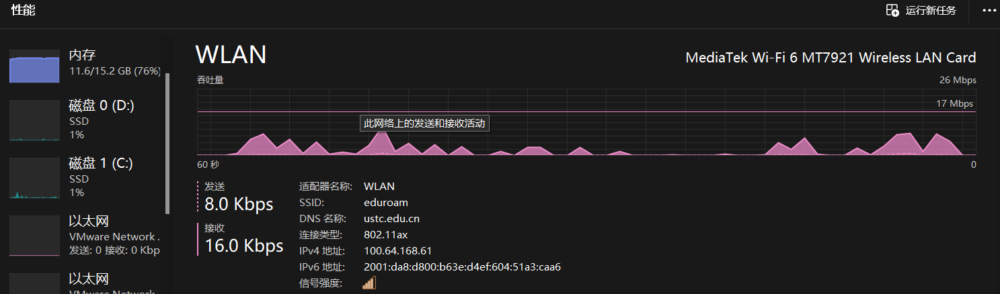
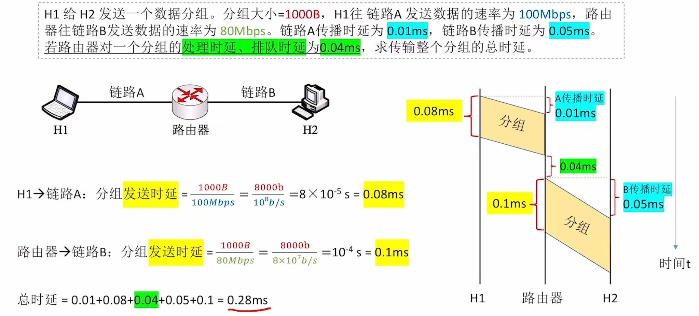
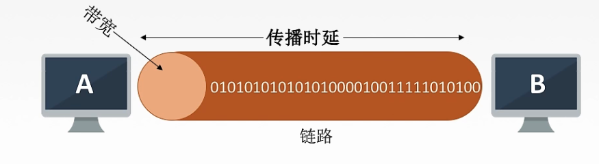
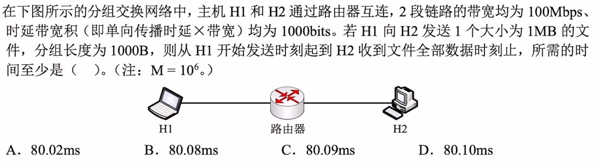
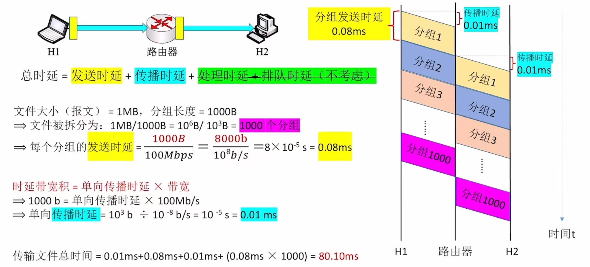
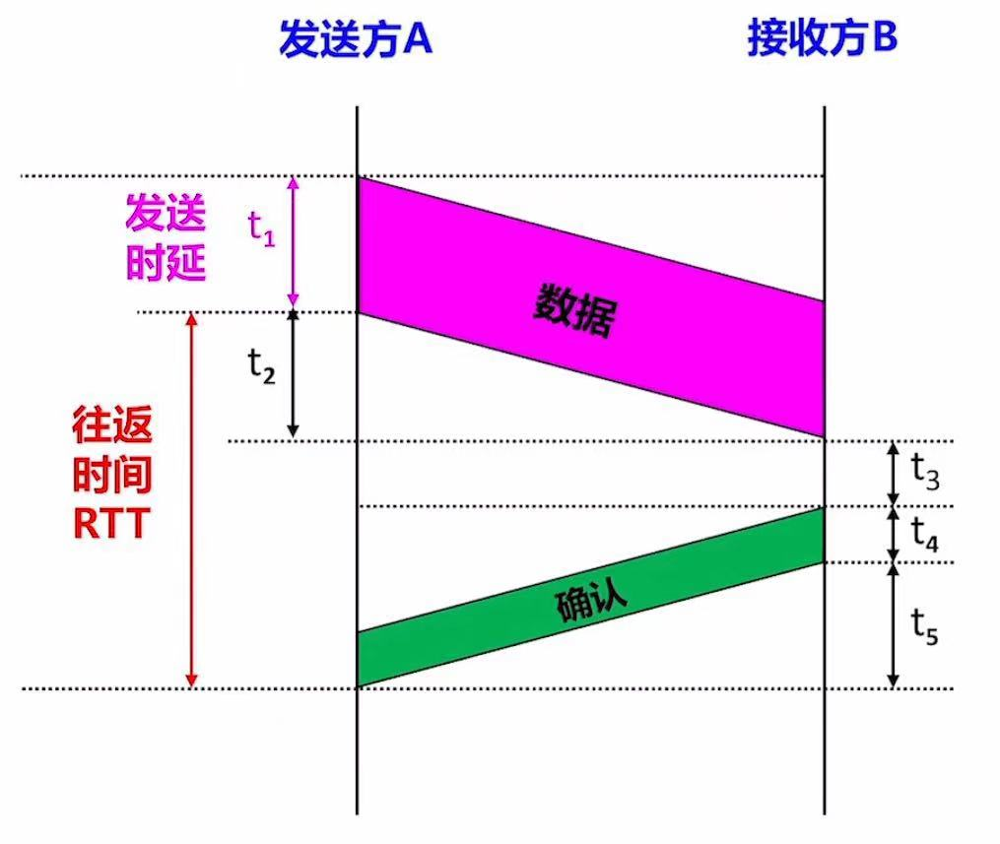

# 计算机网络的性能指标（高频考点！！！）

### **日期**: 2024 年 10 月 14 日

---

知识总览

- 速率、带宽、吞吐量：三者单位相同
- 时延、时延带宽积、往返时延
- 信道利用率

---

## **速率**

- ### **信道**：表示向某一方向传送**信息的通道**（信道 ≠ 通信线路）。一条通信线路在逻辑上往往会对应一条**发送信道**和一条**接收信道**。

  - 如 Figure1，**发送信道**速率为 8.0Kbps，**接收信道**速率为 16.0Kbps

- ### **速率（Speed）**：指连接到网络上的节点在信道上传输数据的速率。也称为**比特率**、**数据率**、**数据传输速率（最常用）**
- ### **速率单位**：**比特每秒**（bit/s），或 b/s，或**bps**（最常用，即 bit per second 缩写），三者完全等价
  - ### **注意**：有时也会见到 B/s（1B = 8b，B 是 Byte 字节，而 b 是 bit 比特），如 **1MB/S = 8Mbps**
  - **计算机网络中常用数量前缀**：k(千 1e3)、M(兆 1e6)、G(吉 1e9)、T(太 e12)，如非特别强调，则**计网题目以此为准**
  - **计组和 OS 中常用数量前缀**：K(2e10 即 1024)、M(2e20)、G(2e30)、T(2e40)，需要和计网进行区分，如非特别强调，则**计组、OS 题目以此为准**

---

## **带宽**

- ### **带宽（bandwidth）**：某信道所能传输的**最高数据率**，即**信道的传输能力**（**单位同速率**）
- ### **例题**：假设主机 A 和 B 之间的链路带宽为 100Mbps，主机 A 的网卡速率为 1Gbps，主机 B 的网卡速率为 10Mbps，主机 A 给主机 B 发送数据的最高理论速率为多少？

  - **答案**：10Mbps，因为主机 B 的网卡速率为 10Mbps，这是链路各限制最低值，如果比这个值更大，则会造成数据丢失
  - **结论**：**节点间通信实际能达到的最高速率，由带宽、节点性能共同限制**

- ### **学以致用**：检查家用路由器连接光猫的网线，看看是否能达到运营商承诺的最大带宽，不能则换（注意是几类网线）；检查家用路由器 WAN 口最高速率

- ### **补充**：在《通信原理》中，带宽（bandwidth）表示某通道运许通过的信号频带范围。单位为 Hz(赫兹)，可加前缀 k、M、G 等。人眼也是一种信道，其看到的电磁波频率范围即为带宽。
  - 两个带宽本质都是在反映传输数据的能力
  - 之后会学习**香农定理**和**奈氏准则**，会对两种带宽的内在联系进行详细探讨，不涉及这两个概念时，计网中的带宽仅指前面一种

---

## **吞吐量**

- ### **吞吐量（throughput）**：表示在**单位时间**内通过某个网络（或信道、接口）的**实际数据量**
  - 吞吐量受带宽限制、受复杂的网络负载情况影响
  - e.g. 同一根网线信道 1（发送信道）吞吐量为 1.8MB/s，信道 2（接收信道）吞吐量为 93.3MB/s，则
    - 网线的吞吐量 = 1.8MB/s + 93.3MB/s = 95.1MB/s
    - 电脑网卡吞吐量 = 1.8MB/s + 93.3MB/s = 95.1MB/s
- ### **吞吐量和速率辨析**

  - 简单来说，吞吐量和速率之间的主要区别在于：

    - 吞吐量是针对整个系统而言的性能指标，它关注的是实际被成功处理的数据量。

    - 速率则可能更多地指理论上或单个连接上的最大数据流动速度，有时并不直接反映最终用户能体验到的实际数据处理能力。

  - 在某些情况下，这两个术语可能会互换使用，尤其是在它们都用于描述数据传输速度的时候。但是，严格地说，吞吐量考虑了诸如错误重传、协议开销等因素后的净数据传递效率，而速率可能只是单纯的技术规格或理论上限。

---

---

## **时延**

- ### **时延（Delay）**：指数据（一个报文或分组甚至比特）从网络（或链路）的**一端传送到另一端所需的时间**。有时也称延迟或迟延
- ### **总时延 = 发送时延 + 传播时延 + 处理时延 + 排队时延**

  - **发送时延**：又名**传输时延**，节点将数据推向信道所花的时间，**数据长度(bit)/发送速率(bps)**
  - **传播时延**：电磁波在信道中传播一定的距离所花的时间，**信道长度(m)/电磁波在信道中的传播速度(m/s)**
  - **处理时延**：被路由器处理所花的时间（如：首部分析、查找存储转发表），受多方影响，考试一般不多考虑
  - **排队时延**：数据排队进入、排队发出路由器所花的时间，受多方影响，考试一般不多考虑

- ### **例题**
  

---

## **时延带宽积**

- ### **时延带宽积(bit) = 传播时延(s) × 带宽(bit/s)**

  

- ### **含义**：一条链路中，**已**从发送端**发出但尚未到达**接收端的**最大比特数**

- ### **注意**：时延带宽积常用于设计最短帧长（在后续章节中学习）

- ### **例题**
  
  - **答案**：D
    

---

## **往返时延**

- ### **往返时延 RTT（Round-Trip Time）**：表示从发送方**发送完数据**，到发送方**收到来自接收方的确认**总共经历的时间（也有些其他不同的定义，但由于这种有更加广泛所以采用）
  
- ### **如图是假设 A 和 B 直连的情况，t2 为传播时延，t3 为处理时延，t4 为发送时延，t5 为传播时延**
- ### **实例**：游戏延迟，反映的就是“手机-服务器”之间的**往返时延**

---

## **信道利用率**

- ### **信道利用率**：某个信道有百分之多少时间是有数据通过的

  - 即**信道利用率 = 有数据通过的时间/(有数据通过的时间 + 没有数据通过的时间)**

- ### **例题**：手机 H1 和 H2 通过蓝牙连接，连接时长为 1 分钟。在此期间，H1 给 H2 以 80Mbps 的速率传输了一张大小 10MB 的照片。求蓝牙连接期间的信道利用率

  - **答案**：33.3%

- ### **网络利用率**（考试很少涉及）：把网络中所有信道利用率求加权平均

- ### **信道利用率不能太低，否则会浪费资源**
- ### **信道利用率不能太高，否则容易导致网络拥塞**
