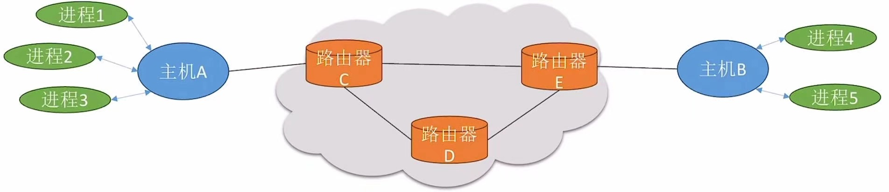

# 计算机网络分层结构

### **日期**: 2024 年 10 月 15 日

---

知识总览

- “分层”的设计思想
- 三种常见的计算机网络体系结构
- 各层之间的关系
- PDU/SDU/PCI
- 协议的三要素
- 注：“体系结构”只涉及定义，不涉及具体实现

---

## **“分层”的设计思想**

- ### **“分层”的设计思想**：将庞大而复杂的问题，转化为若干较小的局部问题

- ### **以快递网络为例**

  

  - **可以在快递员和顾客之间加入一层快递驿站**

  - **快递网络是一个非常复杂的系统，需要完成很多功能：**
    - 货物打包
    - 取件、派件
    - 冷链存储
    - 包裹“路由”（规划路径）
    - 运输包裹
    - ......
  - **将复杂的快递网络在逻辑上划分为多个层次，并将各种“功能”安排在合适的层次中**
  - **不同类型的节点，实现的功能层次可能不一样**

- ### **计算机网络要完成的功能**

  

  - **快递网络是一个非常复杂的系统，需要完成诸多功能：**
    - **差错控制**：确保数据在传输过程中不出错
    - **流量控制**：发送端的发送速率必须使接收端来得及接收，不要太快
    - **分段和重装**：发送端将要发送的数据块划分为更小的单位，并在接收端将其还原
    - **复用和分用**：发送端几个高层会话复用一条低层的连接，并在接收端将其还原
    - **连接的建立、维持和释放**：交换数据前会先建立一条逻辑链接，数据传送结束后释放连接
    - **......**

- ### **计算机网络的分层结构**

  - **将复杂的计算机网络在逻辑上划分为多个层次，并将各种“功能”安排在合适的层次中**
    

    0. 物理传输媒体
    1. 物理层
    2. 数据链路层
    3. 网络层
    4. 传输层
    5. 应用层

  - **分层结构的设计并不唯一，可以根据实际需求增加或减少层次**

---

- ### **三种常见的计算机网络体系结构**

  

  - 如图是三种常见的计算机网络体系
    - **OSI 体系结构**：国际标准化组织（ISO）制定的开放系统互联参考模型
    - **TCP/IP 体系结构**：互联网所采用的体系结构
    - **五层协议体系结构**：计算机网络教学中的常用体系结构

- ### **网络体系结构的概念**

  - **网络体系结构（Network Architecture）**：计算机网络层次划分及其每一层的协议的**集合**，就是这个计算机网络及其构件所能完成的**功能的精确定义（不涉及实现）**

  - **实现**（implementation）是遵循这种体系结构的前提下，用何种硬件或软件来完成这些功能的问题
  - 体系结构是**抽象**的，而实现则是**具体**的

---

## **各层之间的关系**

- ### **水平视角**

  - **实体**：在计算机网络的分层结构中，第 n 层中的活动元素（软件+硬件），通常称为第 n 层实体。不同机器上的同一层称为**对等层**，同一层的实体称为**对等实体**
  - **协议**：即网络协议（Network Protocol），是控制对等实体之间进行通信的规则的集合，<u>**是水平的**</u>

- ### **垂直视角**

  - **接口**：即同一节点内**相邻两层的实体**交换信息的逻辑接口，又称为**服务访问点**（Service Access Point, SAP）
  - **服务**：指**下层为紧邻的上层**提供的功能调用，<u>**是垂直的**</u>
    - 服务的分类后续再学习
  - 上一层通过“接口”请求相邻下层的“服务”，下层通过“接口”向上层提供“服务”

---

## **数据传输过程（水平视角）**

- ### 在用户看来，数据似乎是被原封不动地传输的，用户感知不到数据被压缩、解压缩的过程
  - **YSCS 协议**（压缩传输协议）
    - 发送方将数据压缩后，需要增加“首部”，说明采用了哪种压缩算法
    - 接收方根据“首部”信息选择解压缩算法将数据解压
    - ...其他规定...
- ### **为什么要分层？为什么要指定协议？**
  - 计算机网络功能复杂 -> 采用分层结构 -> 将诸多功能合理地划分在不同层次 -> 对等层之间制定协议，以实现功能

## **数据传输过程（垂直视角）**

- 自上而下增加协议，自下而上按协议处理并拆除对应层协议
- ### **协议数据单元（PDU）**：对等层次之间传送的数据单位。第 n 层的 PDU 记为 n-PDU
  - 例如**3-PDU**包含 H5、H4、H3（其中 Hn 是第 n 层增加或拆除的协议），即包含当层首部尾部所有信息
- ### **服务数据单元（SDU）**：为完成上一层实体所要求的功能而传送的数据。第 n 层的 SDU 记为 n-SDU
  - 例如**3-SDU**包含 H5、H4（其中 Hn 是第 n 层增加或拆除的协议），即包含上层首部尾部所有信息
- ### **协议控制信息（PCI）**：控制协议操作的信息。第 n 层的 PCI 记为 n-PCI
  - 例如**3-PCI**包含 H3（其中 Hn 是第 n 层增加或拆除的协议），即包含当层增加或拆除的协议信息
- ### **三者关系**：n-SDU + n-PCI = n-PDU = (n-1)-SDU，示例如下图
  

---

## **协议的三要素**

- ### **协议**：即网络协议（Network Protocol），是控制对等实体之间进行通信的规则的集合，<u>**是水平的**</u>

- ### **协议由语法、语义和同步三部分组成（协议的三要素）**
  - **语法**：数据参与控制信息的格式
    - 例如：协议控制信息（首部）部分占几个字节、每个字节是什么含义；协议的数据部分最多有多少字节
    - 描述了一个协议的 SDU 和 PCI 的格式
  - **语义**：即需要发出何种控制信息、完成何种动作以及做出何种应答
    - 例如：协议中需要明确规定发送方发送完数据后，接收方是否需要“应答”，以及应答的种类有哪些（如传输成功、传输失败等）
    - 描述了**对等实体**“**做什么**”的问题
  - **同步**（或**时序**）：执行各种操作的条件、时序关系等，即事件实现顺序的详细说明。
    - 例如：发送方发送完一个数据后，接收方需要立即应答。如果发送方在 10 秒内为收到“传输成功”应答，则发送方会再次发送数据
    - 描述了“**什么时候做**”的问题
