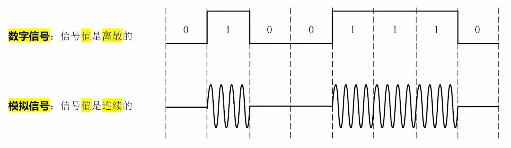
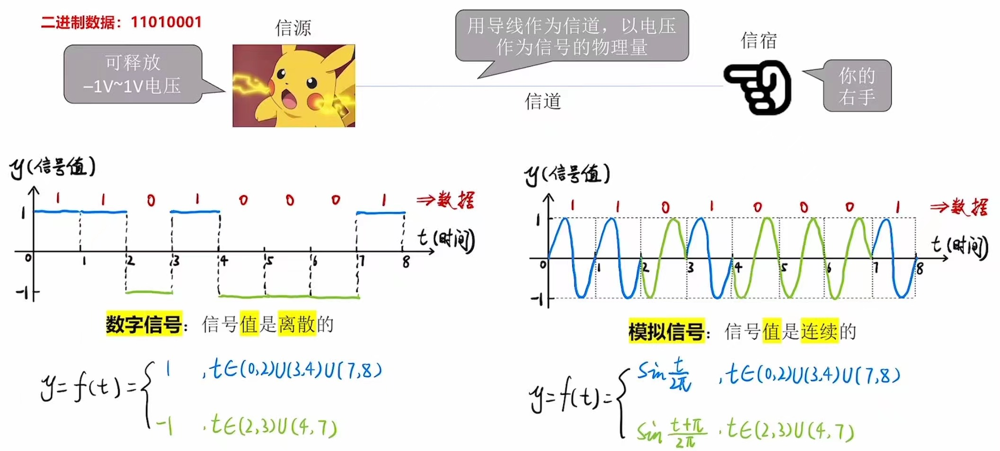
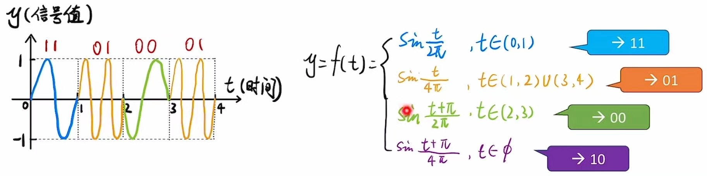

# 《通信基础》基本概念

### **日期**: 2024 年 10 月 16 日

---

知识总览

- 信源、信宿、信号、信道
- **码元、码率、波特**
- 带宽(Hz)

---

## **信源、信宿、信号、信道**

- ### **信源**：信号的来源（即数据的发送方）
- ### **信宿**：数据的“归宿”（即数据的接收方）
- ### **数据**：即信息的实体（如文字、声音、图像），在计算机内部数据通常是二进制
- ### **信道**：信号的通道
  - 注：一条物理线路通常包含两条信道，即**发送信道**、**接收信道**
- ### **信号**：数据的载体
  - **数字信号**：信号**值**是**离散**的
  - **模拟信号**：信号**值**是**连续**的

## **数字信号、模拟信号**

## **从数学函数的角度理解信号值**

---

## **码元的概念**

- ### 例：**在一个“信号周期”内，有可能出现<u>2 种信号</u>，每种信号对应一个<u>2 进制数</u>，每一个信号就是一个<u>码元</u>**
- ### 可以把“信号周期”称为“**码元宽度**”
- ### **如果一个信号周期内可能出现 4 种信号，那么每个信号就可以对应一个 4 进制数(2bit)**
  - 2V-00
  - 1V-01
  - -1V-10
  - -2V-11
  - **优点**：每个信号周期可以传输更多信息。换句话说，每个**码元**可以携带更多信息
  - **代价**：需要加强信号功率，并且对信道的要求更高
  - 如果一个码元（即一个信号）可能有 4 种状态，那么可以称其为**4 进制码元**（一个码元携带 2bit 数据）
  - 类似的，如果一个码元（即一个信号）可能有 8 种状态，那么可以称其为**8 进制码元**（一个码元携带 3bit 数据）
  - ......
  - 如果一个码元（即一个信号）可能有 k 种状态，那么可以称其为**k 进制码元**（一个码元携带 $log_2k$ bit 数据）

## **用模拟信号设计 4 进制码元**

## **！！！重要：码元和比特的关系**

- ### **如果一个“周期”内可能出现 K 种信号，则：**

  - ## **1 码元 = $log_2K$ bit**

## **速率**

- ### **波特率**：每秒传输的**码元**个数，单位是**波特**
  - 每秒传输几个码元
  - 单位：**码元/秒**，或**波特(Baud)**
- ### **比特率**（码率）：每秒传输的**比特**个数，单位是**比特/秒**（bps）
  - 每秒传输几个比特
  - 单位：**bit/s**，或**b/s, bps**
- ### **注**：若一个码元携带 n 比特的信息量，则波特率 M Baud 对应的比特率为 M\*n bps
  - 或**1 波特 = $log_2K$ bps**
