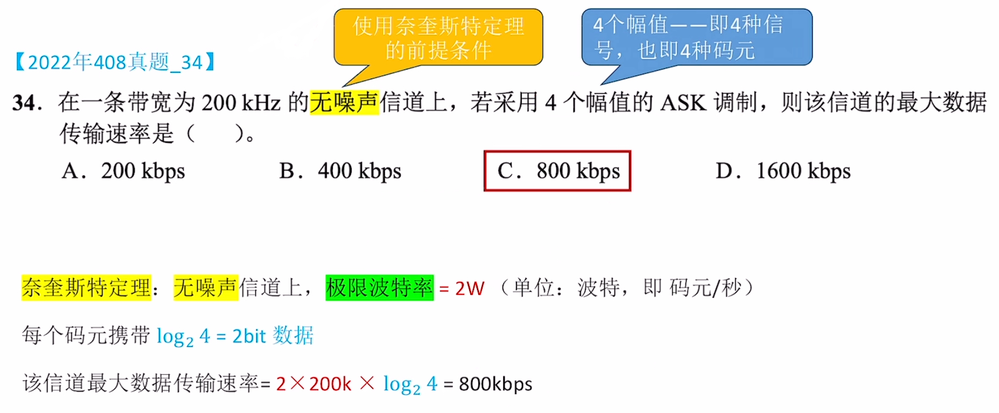
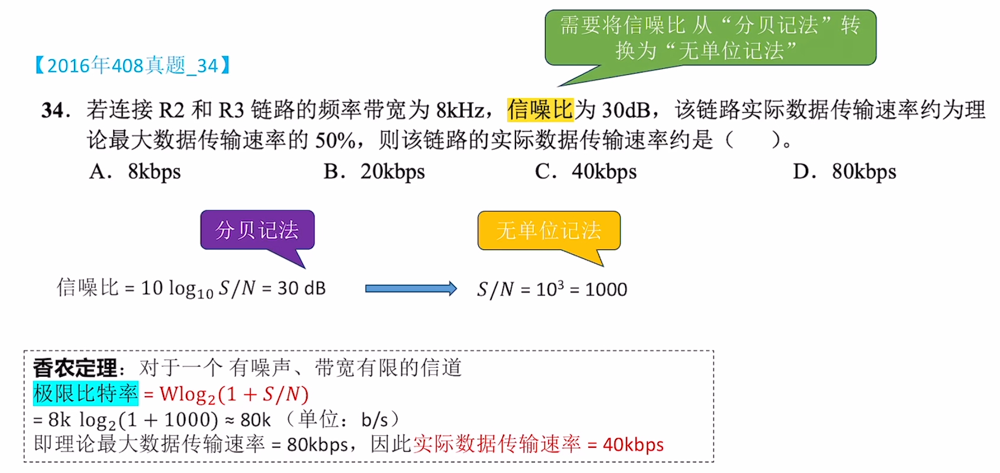

# 信道的极限

### **日期**: 2024 年 10 月 17 日

---

知识总览

- 回顾：信道带宽(Hz)的概念
- 噪声的概念
  - 噪声会影响信道的数据传输结果
- 奈奎斯特定理
  - **无噪声**情况下信道的**极限波特率**
- 香农定理
  - **有噪声**情况下信道的**极限比特率**

---

## **回顾：带宽**

- ### **计算机网络中的带宽（bandwidth）**：某信道所能传输的**最高数据率**，即**信道的传输能力**（**单位同速率**）

- ### **通信原理中的带宽**：在《通信原理》中，带宽（bandwidth）表示某通道**允许通过的信号频带范围**。单位为 **Hz** (赫兹)，可加前缀 k、M、G 等。人眼也是一种信道，其看到的电磁波频率范围即为带宽。

- ### **两个带宽本质都是在反映传输数据的能力**

## **噪声**

- ### **对信道产生干扰，影响信道的数据传输效率**

---

## **奈奎斯特定理（奈氏准则）**

- ### **奈奎斯特定理**：对于一个<u>**理想低通信道**</u>（没有噪声、带宽有限的通道）:
  - ### **<u>极限波特率</u>** = $2W$（单位：波特，码元/秒），其中 W 是信道的频率带宽（单位：Hz）
  - ### **<u>极限比特率</u>** = $2W\log_2K$（单位：比特/秒），其中 K 是每个信号周期内可能出现的信号种类数
- ### **例题 1**
  

## **香农定理**

- ### **香农定理**：对于一个<u>**有噪声、宽带有限的信道**</u>:
  - ### **<u>极限比特率</u>** = $2W\log_2(1+S/N)$（单位：b/s），其中 W 是信道的频率带宽（单位：Hz），S/N 是信道中的信噪比
    - ### **信噪比**：$S/N = \frac{信号的功率}{噪声的功率}$，
    - ### 信噪比越高，噪声对数据传输的影响越小
    - ### **以分贝(dB)为单位表示信噪比**：信噪比 = $10\log_{10}\frac{S}{N}$，单位为分贝(dB)
    - ### $S/N信噪比 = 10^{\frac{db信噪比}{10}}$
- ### **例题 2**
  

## **奈奎斯特定理&香农定理**

- ### **奈奎斯特定理**：对于一个<u>**理想低通信道**</u>（没有噪声、带宽有限的通道）:

  - ### **<u>极限波特率</u>** = $2W$（单位：波特，码元/秒），其中 W 是信道的频率带宽（单位：Hz）

- ### **奈奎斯特定理说明**

  - ### 如果波特率太高,会导致“**码间串扰**”，即接收方无法识别码元
  - ### 带宽越大，信道传输码元的能力越强
  - ### 奈氏准则并未对一个码元最多可以携带多少个比特做出解释

- ### **香农定理**：对于一个<u>**有噪声、宽带有限的信道**</u>:

  - ### **<u>极限比特率</u>** = $2W\log_2(1+S/N)$（单位：b/s），其中 W 是信道的频率带宽（单位：Hz），S/N 是信道中的信噪比

- ### **香农定理说明**
  - ### 提升信道带宽、加强信号功率、降低噪声功率，都可以提升信道的极限比特率
  - ### 结合奈氏准则定理可知，在带宽、信噪比确定的信道上，一个码元可以携带的比特数是有上限的
