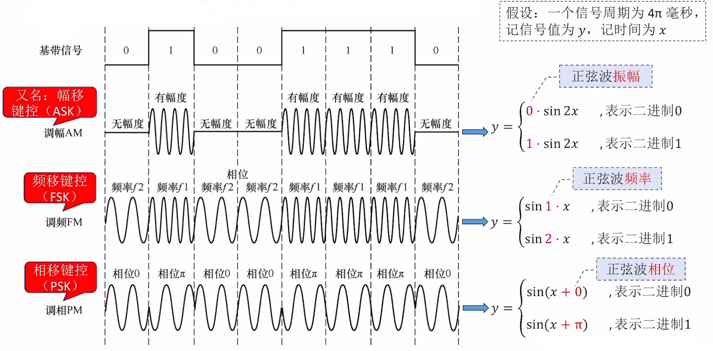

# 编码与调制

### **日期**: 2024 年 10 月 17 日

---

知识总览

- 概念：编码&解码、调制&解调
- 常用的编码方法
  - 不归零编码（NRZ）
  - 归零编码（RZ）
  - 反向非归零编码（NRZI）
  - 曼彻斯特编码
  - 差分曼彻斯特编码
- 常用的调制方法
  - 调幅（AM）
  - 调频（FM）
  - 调相（PM）
  - 正交幅度调制（QAM）

---

## **编码&解码、调制&解调**

- ### **变换器**：将二进制数据转换为信号
- ### **反变换器**：将信号转换为二进制数据
- ### **编码&解码**
  - ### **编码**：二进制数据 $\to$ 数字信号
  - ### **解码**：数字信号 $\to$ 二进制数据
  - **有线网络适配器（编码-解码器）**
- ### **调制&解调**
  - ### **调制**：二进制数据 $\to$ 模拟信号
  - ### **解调**：模拟信号 $\to$ 二进制数据
  - **光猫（Optical modem，调制-解调器）**

## **常见编码方法**

- ### **不归零编码（NRZ）**：低 0 高 1，中不变
  - 需要额外一条时钟线统一节奏
- ### **归零编码（RZ）**：低 0 高 1，中归零
  - 统一节奏，避免误差
- ### **反向非归零编码（NRZI）**：跳 0 不跳 1 看起点，中不变
  - **NRZI**: Non-Return-to-Zero Inverted
- ### **曼彻斯特编码**：跳 0 反跳 1 看中间，中必变
  - **默认！！！**：上跳为 0，下跳为 1
  - 也有下跳为 0，上跳为 1
- ### **差分曼彻斯特编码**：跳 0 不跳 1 看起点，中必变
  - 跳变节奏有利于信号同步
  - 抗干扰能力更强

## **各种编码特点**

- ### **自同步能力**：信源和信宿可以根据信号完成“节奏同步”，无需时钟信号

| 编码             | 自同步能力                                       | 浪费带宽           | 抗干扰能力 |
| ---------------- | ------------------------------------------------ | ------------------ | ---------- |
| 不归零编码       | 无                                               | 不浪费             | 弱         |
| 归零编码         | 有                                               | 浪费               | 弱         |
| 反相非归零编码   | 若增加冗余位 （eg: 8+1bit）,  可支持自同步 | 浪一点， 但不多 | 弱         |
| 曼彻斯特编码     | 有                                               | 浪费               | 强         |
| 差分曼彻斯特编码 | 有                                               | 浪费               | 很强       |

- ### **注意**：反相非归零编码可以每 8 个 bit 增加一个 0，手动实现自同步
- ### **例题 1**

  

- ### **例题 2**

  

- ### **注意**：也不排除考察上 1 下 0 的曼彻斯特编码

---

## **常见调制方法**

- ### **基带信号**：来自信源的数字信号，需**调制**后才能在某些信道上传输
- ### **调幅 AM**：又名辐移键控（**ASK**），0 和 1 的幅度不同
- ### **调频 FM**：又名频移键控（**FSK**），0 和 1 的频率不同
- ### **调相 PM**：又名相移键控（**PSK**），0 和 1 的相位不同
- ### **如何让一个码元携带更多比特数？**
  - **FM**：设计 K 个幅值
  - **PM**：设计 K 个频率
  - **PM**：设计 K 个相位
  - **效果**：1 码元 = $\log_2K$ 比特

## **正交幅度调制（QAM）**

- ### 若设计**m 中幅值**、**n 种相位**，则将 AM、PM 两种信号“复合”，可以调制出**mn 种符号**，则此 QAM 有 1 码元 = $\log_2mn$ bit
- ### **注意**

  - 上述信号可称为**QAM-mn**
  - **QAM-n**的意思是有 n 种信号的 QAM 调制方案
  - 例如**QAM-16**就是调制 16 种信号，1 码元携带比特数为$\log_216 = 4$

- ### **例题 3**
  
  - **答案**：C
- ### **例题 4**
  
  - **答案**：B

## **总结：各种编码的特点**

|            | 不归零（NRZ） | 归零（RZ） | 反向非归零（NRZI）           | 曼彻斯特编码 | 差分曼彻斯特编码 |
| ---------- | ------------- | ---------- | ---------------------------- | ------------ | ---------------- |
| 自同步能力 | 无            | 有         | 若增加冗余位 可实现自同步 | 有           | 有               |
| 浪费带宽？ | 无            | 浪费       | 不太浪费                     | 浪费         | 浪费             |
| 抗干扰能力 | 弱            | 弱         | 弱                           | 强           | 强               |

- ### 在题目中，**以太网默认使用<u>曼彻斯特编码</u>**
