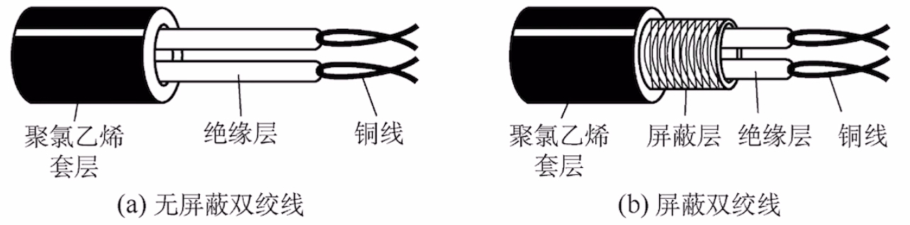
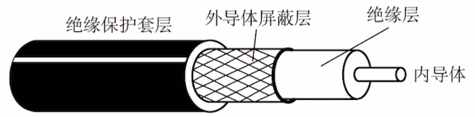
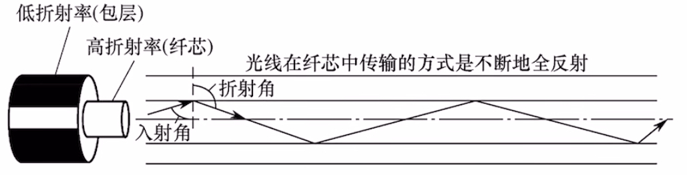
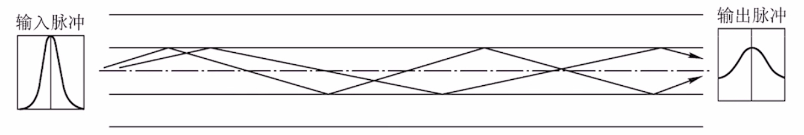
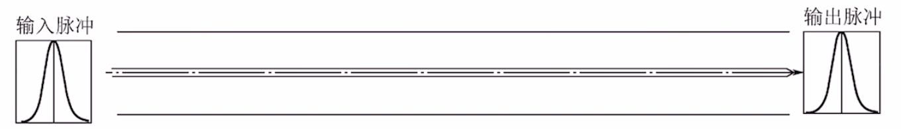

# 传输介质

### **日期**: 2024 年 10 月 18 日

---

知识总览

- 传输介质（transmission medium，也可译为“传输媒体”）
  - 常用的传输介质
    - 导向型：双绞线、同轴电缆、光纤（单模光纤、多模光纤）（从左到右抗干扰能力依次增强，信号传输损耗依次降低）
      - 通常为有线，信号朝固定方向传播
    - 非导向型：无线传输介质
      - 通常为电磁波，信号朝四面八方传播
  - 物理层接口的特性

---

## **双绞线（Twisted Pair）**

- ### **主要构成**：两根导线相互**绞合**而成
  - **有屏蔽层**：屏蔽双绞线（**STP**, Shielded Twisted Pair）
  - **无屏蔽层**：非屏蔽双绞线（**UTP**, Unshielded Twisted Pair）
- ### **抗干扰能力**：较好。**绞合**、**屏蔽层**可以提升抗电磁干扰能力
  - **绞合**：两根导线拧成麻花状，提升绞合度可以增强抗干扰能力
  - **屏蔽层**：将导线包裹在金属网中，屏蔽电磁干扰，增强屏蔽层也可以增强抗干扰能力
- ### **代表应用**：近些年的局域网、早期电话线

## **同轴电缆（Coaxial Cable）**

- ### **主要构成**：**内导体**+**外导体屏蔽层**
  - **内导体**用于传输信号
  - **外导体屏蔽层**用于抗电磁干扰
- ### **抗干扰能力**：好。屏蔽层带来良好的抗干扰性
  - 内导体越粗，电阻越低，传输过程中信号衰减越少，传输距离越长
- ### **代表应用**：早期局域网、早期有线电视

## **光纤（Optical Fiber）**

- ### **主要构成**：**纤芯** + **包层**
  - **纤芯**有高折射率
  - **包层**有低折射率
  - 利用**光的全反射**特性，在纤芯内传输光脉冲信号
- ### **分类**：单模光纤、多模光纤
  - **单模光纤**：只有**一条光线**在一根光纤中传输，适合**长距离**传输，信号传输损耗小
  - **多模光纤**：有**多条光线**在一根光纤中传输，适合**近距离**传输，远距离传输光信号容易失真
- ### **抗干扰能力**：非常好。光信号对电磁干扰不敏感，光纤本身不导电，抗干扰能力强
- ### **其他优点**：信号传输损耗小，长距离传输时中继器少；很细很省布线空间

## **多模光纤、单模光纤**

- ### **多模光纤**
  
  - **特点**：纤芯更粗，可同时传输**多条光线**，信号**传输损耗更高**。适合较**近距离传输**
  - 入射角出射角对应不同光线
  - 多模光纤外皮为橙色或青绿色（薄荷绿，蓝绿）
- ### **单模光纤**

  

  - **特点**：纤芯更细，直径小于一个波长，只能传输**一条光线**，信号**传输损耗低**。适合**远距离传输**
  - 纤芯直径大概 9 微米左右，当纤芯小于波长时，光在纤芯中传播时，只能沿着一条路径传播，不会发生全反射，因此只能传输一条光线
  - 无法通过出射角和入射角来区分不同光线
  - 单模光纤外皮为黄色，家用一般为单模光纤

## **以太网对有线传输介质的命名规则**

- ### **速度 + Base + 介质信息**
  - **Base**：Baseband，基带传输，即传输数字信号（采用曼彻斯特编码）
- ### **示例**
  - **10Base5**：10 Mbps，同轴电缆，最远传输距离 500m
  - **10Base2**：10Mbps，同轴电缆，最远传输距离 200m（实际是 185m）
  - **10BaseF\***：10Mbp，光纤。\*可以是其他信息，如 10BaseFL、10BaseFB、10BaseFP...
  - **10BaseT\***：10Mbps，双绞线。\*可以是其他信息，如 10BaseT1S、10BaseT1L...
- ### **其他示例**
  - **1000BaseT1**：1000Mbps，双绞线
  - **2.5GBaseT**：**2.5Gbps**，双绞线

---

## **无线传输介质（非导向型传输介质）**

- ### **无线电波（波长较长）**
  - **特点**：**穿透能力强、传输距离长、信号指向性弱**
  - **如**：手机信号、Wi-Fi 信号（频率约 2.4GHz）
- ### **<u>微波（短波）通信</u>**
  - **特点**：**频率带宽高、信号指向性强**、保密性差（容易被窃听）
  - **如**：卫星通信（卫星作为中继器，传播时延较大），高速卫星信号频率约 40GHz
- ### **其他**：红外线通信、激光通信等——信号指向性强
- ### 本质都是使用电磁波，电磁波有 **c = λf**，c 为光速，λ 为波长，f 为频率
  - 电磁波频率、波长呈反比关系
  - **频率越高，数据传输能力就越强**
  - **波长越短**，“信号**指向性**”**越强**，信号越趋于直线传播
  - **波长越长**，“信号**绕射性**”**越好**，也就是信号“穿墙”能力越强
    - 短波通信需要对准，长波通信不需要
- ### **结论**
  - **长波**更适合长距离、非直线通信
  - **短波**更适合短距离、高速通信，若用于长距离通信需建立中继站
  - **短波**信号指向性强，要求信号接收器“对准”信号源
- ### **卫星通信（微波通信）示例**
  - **特点**：传播时延较大，可用近地卫星群解决

---

## **物理层接口的特性**

- ### **机械特性**：指明接口所用接线器的形状和尺寸、引脚数目和排列、固定和锁定装置等
- ### **电气特性**：指明在接口电缆的各条线上出现的电压的范围、传输速率、距离限制等
- ### **功能特性**：**指明某条线上出现的某一电平的意义**
- ### **过程特性（规程特性）**：指明对于不同功能的可能事件的出现顺序
  - 例如：插上网线应该作何反应？拔掉网线应该作何反应？
