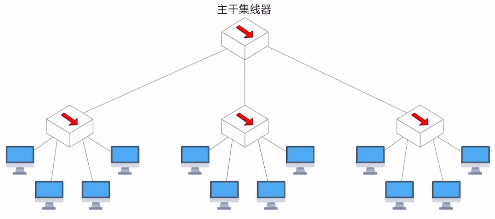
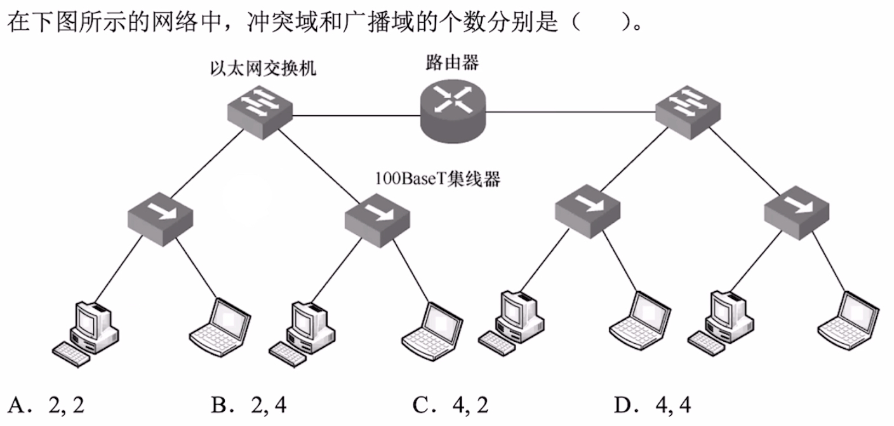

# 物理层设备

### **日期**: 2024 年 10 月 18 日

---

知识总览

- 中继器（Repeater）
- **<u>集线器</u>**（Hub）

---

## **中继器（Repeater）**

- ### **传输距离太长，数字信号会失真**
  
- ### **e.g.** 物理层“\*电气特性”规定——**0.5~1.5V** 为低电平，**4.5~5.5V** 为高电平，不符合此标准的信号视为无效。**中继器**收到信号后，会将**低电平整形为 1V**，将**高电平整形为 5V**，然后再输出

- ### **中继器**
  - 中继器只有**两个端口**。通过一个端口接收信号，**将失真信号整形再生，并转发至另一端口**（信号再生会产生一些时延
  - 仅支持**半双工通信**（两端连接的节点**不可同时发送**数据，否则会导致**冲突**）
  - 中继器两个端口对应两个“**网段**”

## **集线器（Hub）**

- ### **集线器**

  - 本质上是**多端口中继器**。集线器将其中一个端口接收到的**信号整形再生后，转发到其他所有端口**
  - 各端口连接的节点**不可同时发送**数据，否则会导致**冲突**
  - 集线器的 N 个端口对应 N 个“**网段**”，各网段属于同一个**冲突域**

- ### **冲突域（碰撞域）**：如果两台<u>**主机**</u>同时发送数据会导致“冲突”，则这两台主机处于同一个“**冲突域**”
  - 处于同一个冲突域的主机在发送数据前需要进行“**信道争用**”
  - 一个**更大的冲突域**：
    
  - **结论**：**集线器不能“隔离”冲突域**
  - **真题**
    
    - **答案**：**C**。以太网交换机可以隔离冲突域，集线器不可以隔离冲突域，广播域后面再学

## **集线器、中继器的一些特性**

- ### 集线器、中继器**不能“无限串联”**
  - **如 10Base5 的 5-4-3 原则**：使用集线器（或中继器）连接 10Base5 网段时，最多只能串联 **5** 个网段，使用 **4** 台集线器（或中继器），只有 **3** 个网段可以挂接计算机
- ### 集线器连接的各网段“**共享带宽**”

  - **例如**：带宽为 **10Mbps** 的集线器，连接 8 台主机，则每台主机平均只拥有 **1.25Mbps** 的带宽

  - **集线器**连接的网络，**物理上是星形拓扑**，**逻辑上是总线形拓扑**

- ### **以下内容与大部分国内教材有冲突（国内教材某些内容不符合事实）**

```markdown
- 集线器可以连接不同的传输介质（同轴电缆、双绞线等），因此两个网段的物理层接口特性可以不同（这就意味着集线器连接的网段，“物理层协议”可以不同）
- 集线器如果连接了速率不同的网段，会导致所有网段“速率向下兼容”
```

- ### 而大多国内教材描述（与事实不符）如下，**<u>在做题时以以下描述为准</u>**

```markdown
- 中继器、集线器不能连接物理协议不同的网段，也不能连接速率不同的网段
```
