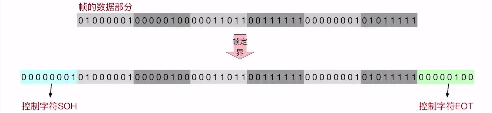

# 组帧（封装成帧）

### **日期**: 2024 年 10 月 19 日

---

知识总览

- 主要问题
  - **帧定界**：如何让接收方能够确定帧的界限
  - **透明传输**：接收方要能够去除“帧定界”的附加信息，把帧“恢复原貌”
- 四种组帧方法
  - **字符计数法**
  - **字节填充法**
  - **零比特填充法**
  - **违规编码法**

---

## **字符计数法**

- ### **原理**：在每个帧开头，用一个**定长计数字段**表示帧长

  - **注意**：帧长 = 计数字段长度 + 帧的数据部分长度

- ### **最大缺点**：任何一个计数字段出错，都会导致后续所有帧无法定界

## **字节填充法**

- ### **原理**：约定控制字符 SOH 作为帧的起始，控制字符 EOT 作为帧的结束

  - **SOH**和**EOT**均属于**ASCII**编码
  - **SOH**: Start of Header, 00000001, #01H
  - **EOT**: End of Transmission, 00000100, #04H

- ### **新的问题**：如果数据部分包含**控制字符**？

  

  - **解决方法**：在数据部分，每个**控制字符**前插入一个**转义字符 ESC**
  - **ESC**: Escape Character, 00011011, #1BH

- ### **新的问题 plus**：如果数据部分包含转义字符（在不需要转义的字符前）？

  

  - **解决方法**：在转义字符前再插入一个转义字符

- ### 如果帧的数据部分包含“特殊字符“，则**发送方**需要**在这些“特殊字符”前填充“转义字符 ESC”**（**接收方**要做**逆处理**）

## **零比特填充法**

- ### 数据链路层的 **HDLC 协议**和 **PPP 协议**使用的就是零比特填充法，这个方法在实际应用上很容易通过物理设备实现，应用广泛

- ### **原理**：约定一个**特殊比特串**表示帧开始/结束

  - 如实际通常使用比特串 01111110

- ### **新的问题**：如果数据部分包含该**特殊比特串**？

  - **解决方法**
    - **发送方**需要对帧的数据部分进行处理，`<u>`**每遇到连续 5 个 1，就填充 1 个 0 `</u>`**
    - **接收方**需要对帧的数据部分进行逆处理，**`<u>`每遇到连续 5 个 1，就删掉后面的 1 个 0 `</u>`**

## **违规编码法**

- ### 在现代计算机网路中很常用
- ### **以曼彻斯特编码为例**

  

  - **曼彻斯特编码（IEEE 标准）**：上 0 下 1 中必变，每个比特的中间时刻一定会出现电平跳变，**`<u>`如果周期中间不跳变，则“违规”`</u>`**
  - 此时只需要在每个帧的**开头结尾各添加一个违规周期**（即中间不跳变的周期），即可实现帧定界
  - 该方法需要物理层的配合
