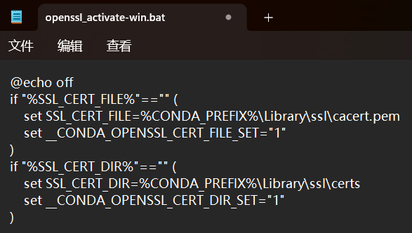

# 操作系统的概念（定义）、功能和目标

### **日期**: 2024 年 10 月 14 日

---

## 知识总览

- 操作系统的概念（定义）：什么是操作系统？
- 操作系统的功能和目标：操作系统要做些什么？
  - 作为系统资源的管理者
  - 向上层提供服务
  - 对硬件机器的扩展

---

## **操作系统的概念（定义）**

- ### **一台电脑的诞生**

  

- ### **操作系统的定义**：**操作系统**（Operating System, OS）是指控制和**管理**整个计算机系统的**硬件和软件**资源，并合理的组织调度计算机的工作和资源的分配；以**提供给用户和其他软件方便的接口和环境**；它是计算机系统中最基本的系统软件。
  1. 操作系统是系统资源的管理者
  2. 向上层提供方便易用的服务
  3. 是最接近硬件的一层软件
  - **直观的例子**：打开 Windows 操作系统的“任务管理器”即可见。

---

## **操作系统的功能和目标——作为系统资源的管理者**

- 裸机（纯硬件）<->操作系统<->应用程序
- ### **提供的功能**
  - 处理机管理
  - 存储器管理
  - 文件管理
  - 设备管理
- ### **目标**

  - 安全
  - 高效

- ### 补充知识：执行一个程序之前，需要将该程序放到内存中，才能被 CPU 处理
- ### **一个例子**：用 QQ 和朋友视频聊天的过程
  1. 在各个文件夹中找到 QQ 安装的位置：逐层打开文件夹，找到 QQ.exe 文件这个程序（可执行文件）的存放位置，这些文件的位置实际是操作系统帮我们管理的——**文件管理**
  2. 双击打开 QQ.exe，操作系统将该程序相关数据放入内存——**存储器管理（内存管理）**
  3. QQ 正常运行，对应的进程被处理机（CPU）处理——**处理机管理**
  4. 在聊天过程中，摄像头、麦克风等设备被分配相应的程序给正常运行——**设备管理**

---

## **操作系统的功能和目标——向上层提供方便易用的服务**

- 操作系统->应用程序（软件）/用户

- 在硬件之上安装了操作系统，操作系统对外暴露了“美丽”、友好的交互接口，而不是硬件对外的简单丑陋的交互接口

- **封装思想**：操作系统把一些丑陋的硬件共嫩南瓜封装成简单易用的服务，使用户能更方便地使用计算机，用户无需关心底层硬件的原理，只需要对操作系统发出命令即可

- ### **GUI**（Graphical User Interface，图形化用户接口）

  - 用户可以使用形象的图形界面进行操作，而不再需要记忆复杂的命令、参数
  - 例子：删除文件只需要将文件拖入回收站
  - 很多现代操作系统都提供 GUI

- ### **联机命令接口（交互式命令接口）**

  - **实例**：Windows 系统

    1. win + R
    2. 输入 cmd
    3. 尝试使用 time 命令，如下图

       

  - **特点**：用户说一句，系统跟着做一句，用户和系统交互

- ### **脱机命令接口（批处理命令接口）**

  - **实例**：Windows 系统

    - 找到类似\*.bat 格式的文件，在记事本中打开

      

  - **特点**：用户说一堆，系统跟着做一堆

- ### **程序接口**
  - 可以在程序中进行**系统调用**来使用程序接口。普通用户不能直接使用程序接口，只能通过程序代码间接使用。该接口是给**软件**（或者说**程序员**）使用的。
  - **实例**：C 语言中的 printf 函数，在 printf 函数的底层就使用到了操作系统提供的显式相关的“系统调用”
    - **系统调用（广义指令）**：类似函数调用，是应用程序请求操作系统服务的唯一方式

---

## **操作系统的功能和目标——作为最接近硬件的层次**

- 操作系统->裸机（纯硬件）
- 没有任何软件支持的计算机称为**裸机**。在裸机上安装的操作系统，可以提供资源管理功能和方便用户的服务功能，将裸机改造成功能更强、使用更方便的机器
- 通常把覆盖了软件的机器称为**扩充机器**，又称之为**虚拟机**
- **类比汽车**
  - 发动机——只会转；轮胎——只会滚
  - 在原始的硬件机器上覆盖一层传动系统——让发动机带着轮胎转——使最原始的硬件机器得到拓展
  - **操作系统对硬件机器的拓展**：将 CPU、内存、磁盘、显示器、键盘等硬件合理地组织起来，让各种硬件能够相互协调配合，实现更多复杂的功能
