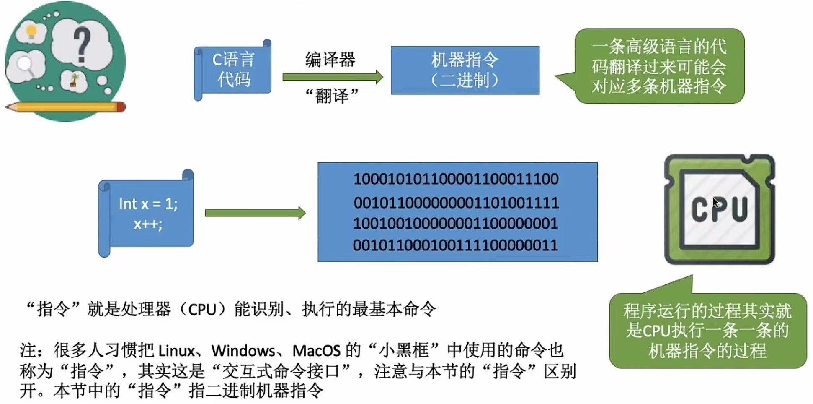

# 操作系统的运行机制

### **日期**: 2024 年 10 月 16 日

---

## 知识总览

- 两种指令
  - 特权指令
  - 非特权指令
- 两种处理器状态
  - 核心态
  - 用户态
- 两种程序
  - 内核程序
  - 系统程序

---

## **预备知识：程序是如何运行的？**

## **内核程序 v.s. 应用程序**

- ### 普通程序员写的程序就是**应用程序**
- ### 微软、苹果等公司一帮人负责实现操作系统，他们写的是“内核程序”
  - 由很多内核程序组成了“**操作系统内核**”，或简称**内核（Kernel）**
  - **内核**是操作系统最核心的部分，也是最接近硬件的部分
  - 夸张来说，一个操作系统只要有内核就够了（e.g. Docker -> 仅需 Linux 内核）
  - 操作系统的功能未必都在内核中国，如图形化用户界面 GUI

## **特权指令 v.s. 非特权指令**

- ### **操作系统内核**作为“管理者”，有时会让 CPU 执行一些“**特权指令**”，如：内存清零指令。这些指令影响重大，只允许“管理者”——即操作系统内核来使用
- ### **应用程序**只能使用“**非特权指令**”，如：加减指令、减法指令等
- ### 在**CPU 设计和生产的时候就划分了特权指令和非特权指令**，因此 CPU 执行一条指令前就能判断出其类型

## **内核态 v.s. 用户态**

- ### 问题产生：CPU 能判断出指令类型，但是它是怎么区分此时正在运行的是内核程序还是应用程序？
- ### 解决方案：**CPU 设计和生产时，划分了两种处理器状态：内核态和用户态**
  - 处于**内核态**时，说明此时正在**运行的是内核程序**，此时**可以执行特权指令**
  - 处于**用户态**时，说明此时正在**运行的是应用程序**，此时**只能执行非特权指令**
  - **拓展**：CPU 中有一个寄存器叫**程序状态字寄存器（PSW）**，其中有一个二进制位，1 表示“**内核态**”，0 表示“**用户态**”
  - **别名**：：内核态 = 核心态 = **管态**；用户态 = **目态**

## **内核态、用户态的切换**

- ### **内核态 -> 用户态**：执行一条**特权指令**——**修改 PSW**的标志位为“用户态”，这个动作意味着操作系统将主动让出 CPU 使用权
- ### **用户态 -> 内核态**：由“**中断**”引发，**硬件自动完成变态过程**，触发中断信号意味着操作系统将强行夺回 CPU 的使用权
  - 除了非法使用特权指令外，还有很多事件会触发中断信号。一个共性是，**但凡需要操作系统介入的地方，都会出发中断信号**
    
