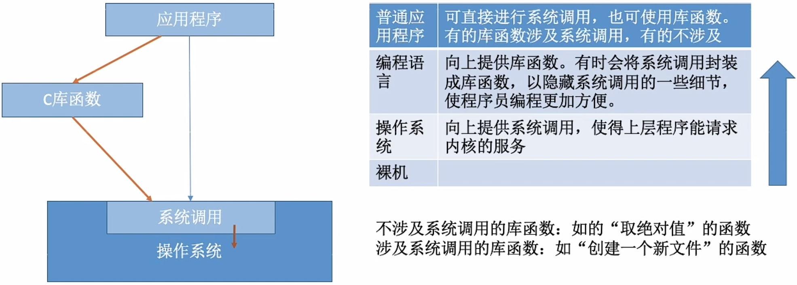

# 系统调用

### **日期**: 2024 年 10 月 17 日

---

### 知识总览

- 什么是系统调用？
- 系统调用与库函数的区别
- 小例子：为什么系统调用是必须的？
- 什么功能要用系统调用实现？
- 系统调用的过程

---

## **什么是系统调用，有何作用？**

- ### **系统调用**：指操作系统给应用程序（程序员/编程人员）使用的接口，可以理解为一种可供应用程序调用的特殊函数，**应用程序可以通国系统调用来请求获得操作系统内核的服务**。

## **系统调用与库函数的区别**

## **小例子：为什么系统调用是必须的？**

- ### **例子**
  - 小明正在用打印机打印 PDF 文件，这时小李也来打印，使用同一台设备打印 Word 文件...
  - 如果两个进程可以随意、并发地共享打印机资源，则会导致两个文件内容混杂在一起...
  - ### **解决方法**：由操作系统内核对共享资源进行统一的管理，并向上提供“系统调用”，用户进程想要使用打印机这种共享资源，只能通过系统调用向操作系统内核发出请求。内核会对各个请求进行协调处理

## **什么功能要用系统调用实现？**

- ### **系统调用按功能分类**

  - **设备管理**：完成对设备的 请求/释放/启动 等功能
  - **文件管理**：完成对文件的 读/写/创建/删除 等功能
  - **进程控制**：完成进程的 创建/撤销/阻塞/唤醒 等功能
  - **进程通信**：完成进程之间的 消息传递/信号传递 等功能
  - **内存管理**：完成内存的 分配/回收 等功能

- ### 应用程序通过**系统调用**请求操作系统的服务。而操作系统中的各种共享资源都由操作系统内核统一掌管，因此**凡是与共享资源有关的操作（如存储分配、I/O 操作、文件管理等），都必须通过系统调用的方式向操作系统内核提出服务请求**，由操作系统内核代为完成。这样可以**保证系统的稳定性和安全性**，防止用户进行非法操作

## **系统调用的过程**

- ### **某程序**

  - **用户态**
    - 传参指令 1——给寄存器存入参数 1
    - 传参指令 2——给寄存器存入参数 2
    - 陷入指令——作为系统调用的入口程序，触发中断，进入内核态
  - **内核态**
    - 内核通过参数确定系统调用类型，如“fork”类
    - 调用相应的系统调用服务
    - 系统调用服务指令 1
    - 指令 2
    - ...
    - 转回用户态
  - **用户态**
    - 指令 4
    - ...

- ### **系统调用的过程**
  - **某高级语言代码执行过程**
    - 代码 1
    - 代码 2
    - 调用**库函数**（该库函数内部封装了**系统调用**的复杂细节）
      - ...（以下均为机器语言指令）
      - 前期处理相关指令
      - 传参指令（将系统调用需要的参数放到某些通用寄存器中）
      - 陷入指令（Trap 指令/访管指令）
        - 转为内核态完成系统调用再返回应用程序
      - 后续处理相关指令
      - ...
    - 代码 4
    - 指令 5
    - ...
  - 传递系统调用参数 -> 执行陷入指令（**用户态**） -> 执行相应的内请求核程序处理系统调用（**核心态**） -> 返回应用程序
  - **注意**
    1. **陷入指令**是**用户态**执行的，执行陷入指令之后立即引发一个**内中断**，使 CPU **进入核心态**
    2. **发出系统调用请求**是在**用户态**，而**对系统调用的相应处理**在**核心态**下进行
    3. 陷入指令 = Trap 指令 = 房管指令
