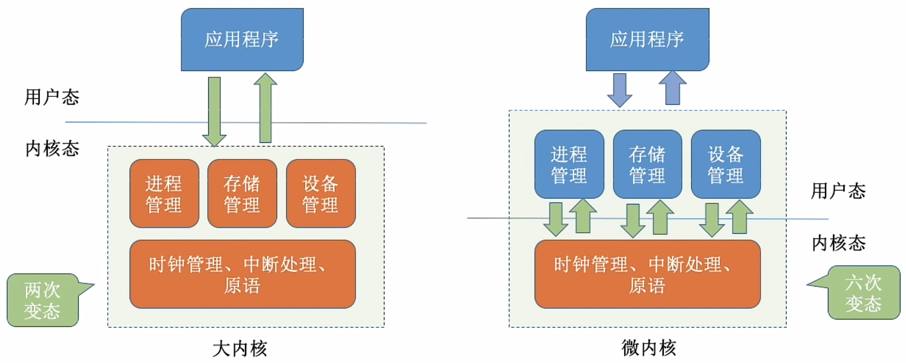

# 操作系统的体系结构

### **日期**: 2024 年 10 月 17 日

---

### 知识总览

- 大内核（又名：宏内核/单内核）
- 微内核
- 分层结构
- 模块化
- 外核
- **一般考选择题**

---

## **操作系统的内核**


- ### **内核**是操作系统最基本、最核心的部分
- ### 实现操作系统内核功能的那些程序就是**内核程序**
- ### **操作系统的内核**

  ```markdown
  - **这一部分与硬件关联较紧密**
  - 时钟管理
    - 实现计时功能
  - 中断处理
    - 负责实现中断机制
  - 原语
    - 是一种特殊的程序
    - 处于操作系统最底层
    - 是最接近硬件的部分
    - 这种程序的运行具有原子性——即其运行只能一气呵成，不可中断
    - 运行时间较短、调用频繁
  ```

  ```markdown
  - **这些管理工作更多的是对数据结构的操作，不会直接涉及硬件**
  - 对系统资源进行管理的功能
    - 进程管理
    - 存储器管理
    - 设备管理
  ```

- ### **大内核与微内核**
  
  - **注意**：
    - 操作系统**内核**需要运行在**内核态**
    - 操作系统的**非内核**功能需要运行在**用户态**

## **操作系统的体系结构**

- ### **两种体系结构**

  

  - 该应用程序需要请求操作系统的服务，该服务同时涉及到进程管理、存储管理、设备管理，则会出现上述情况
  - **注意**：**变态的过程是有成本的**，要消耗不少时间，**频繁地变态会降低系统性能**
  - **！！！特别注意**：此处的**变态**指**CPU 状态的转换**，考试时要规范书写

- ### **大内核**
  - **将操作系统的主要功能模块都作为系统内核，运行在核心态**
  - **优点**：高性能
  - **缺点**：内核代码庞大，结构混乱，难以维护
- ### **微内核**
  - **只把最基本的功能保留在内核**
  - **优点**：内核代码小，结构清晰，容易维护
  - **缺点**：需要频繁地在核心态和用户态之间切换，性能低
- ### **举例**

  - **典型的 大内核/宏内核/单内核 操作系统**：Linux、UNIX
  - **典型的 微内核 操作系统**：Windows NT

---

## **操作系统结构**


## **操作系统结构——分层结构**

- **最底层是硬件，最高层是用户接口，每层可调用更低一层，不能跨层调用**
- ### **优点**
  1. **<u>便于调试和验证，自底向上逐层调试验证</u>**
  2. 易扩充和易维护，各层之间调用接口清晰固定
- ### **缺点**
  1. 仅可调用相邻低层，难以合理定义各层的边界
  2. **<u>效率低，不可跨层调用，系统调用执行时间长</u>**

## **操作系统结构——模块化**

- 模块化是将操作系统按功能划分为若干个具有一定独立性的模块。每个模块具有某方面的管理功能，并规定好各模块间的接口，使各模块之间能通过接口进行通信。还可以进一步将各模块细分为若干个具有一定功能的子模块，同样也规定好各子模块之间的接口。我们把这种设计方法称为模块-接口法
- ### **内核 = 主模块 + 可加载内核模块**
  - **主模块**：只负责核心功能，如进程调度、内存管理
  - **可加载内核模块**：可以动态加载新模块到内核，而无需重新编译整个内核，如设备驱动程序
- ### **优点**
  1. 模块间逻辑清晰易于维护，确定模块间接口后即可多模块同时开发
  2. **<u>支持动态加载新的内核模块（如：安装设备驱动应用程序、安装新的文件系统模块到内核），增强 OS 的适应性</u>**
  3. **<u>任何模块都可以直接调用其他模块，无需采用消息传递进行通信，效率高</u>**
- ### **缺点**
  1. 模块间的接口定义未必合理、实用
  2. 模块间相互依赖，更难调试和验证

## **操作系统结构——宏内核（大内核）**

- ### 所有的系统功能都放在内核里（大内核结构的 OS 通常也采用了“模块化”的设计思想）
- ### **优点**
  1. **性能高，内核内部各自功能都可以直接相互调用**
- ### **缺点**
  1. **内核庞大功能复杂，难以维护**
  2. **大内核中某个功能模块出错，就可能导致整个系统崩溃**

## **操作系统结构——微内核**

- ### 只把中断、原语、进程通信等最核心的功能放入内核。进程管理、文件管理、设备管理等功能以用户进程的形式运行在用户态
- ### **优点**
  1. **内核小功能少，易于维护，内核可靠性高**
  2. **内核外的某个功能模块出错不会导致整个系统崩溃**
- ### **缺点**
  1. **性能低，需要频繁地切换 用户态/核心态。**
  2. **用户态下的各功能模块不可以直接相互调用，只能通过内核的“消息传递”来间接通信**

## **操作系统结构——外核（exokernel）**


- ### **<u>内核负责进程调度、进程通信对等功能，外核负责为用户进程分配未经抽象的硬件资源，且由外核负责保证资源使用安全</u>**
- ### **优点**
  1. **<u>外核可直接给用户进程分配“不虚拟、不抽象”的硬件资源，使用户进程可以更灵活地使用硬件资源</u>**
  2. **<u>减少了虚拟硬件资源的“映射层”，提升效率</u>**
  - 虚拟地址 -> 物理地址，需要映射时间
- ### **缺点**
  1. 降低了系统的一致性
  2. 使系统变得复杂
