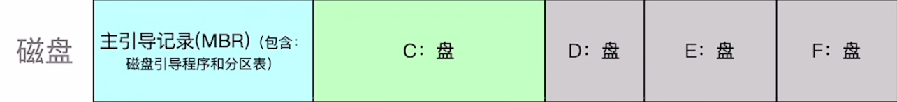
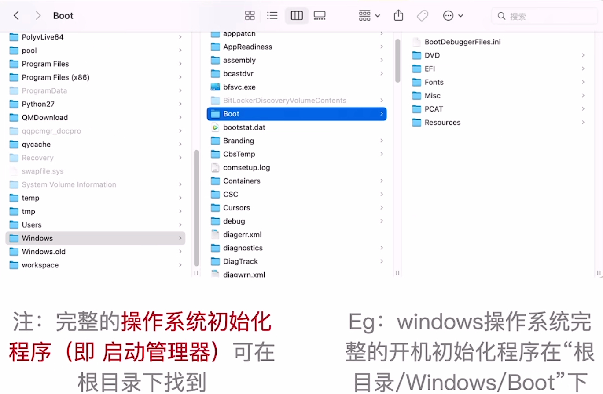

# 操作系统引导

### **日期**: 2024 年 10 月 18 日

---

### 知识总览

- 什么是操作系统引导？
  - 开机的时候，怎么让操作系统运行起来？
- 磁盘里边有哪些相关数据？
- 操作系统引导的过程

---

## **一个刚买的新磁盘（硬盘）**

- ### 空空如也，什么都没有

## **安装操作系统后**

- ### **主引导记录（MBR）**

  - **磁盘引导程序**
    - 见开机过程
  - **分区表**
    - 实际是一个数据结构，说明了各个盘各个分区的地址空间和地址范围

- ### **C 盘**：是这个磁盘的**活动分区**，安装了操作系统
  
  - **引导记录（PBR）**
  - **根目录**
    - 包含启动管理器

## **操作系统引导（开机过程）**

- ### **主存（即内存）**
  - **RAM**：关机就清除内容
  - **ROM**（BIOS，Basic Input/Output System）：包含 ROM 引导程序，即自举程序，关机不清除
- ### **开机过程（粗略描述）**
  - CPU 通电，立即执行 ROM 中的引导程序（自举程序）
  - 自举程序会指示 CPU 去把磁盘的主引导记录读入内存
  - 磁盘引导程序会根据分区表判断 C 盘所处位置
  - 读入 C 盘的引导记录 PBR 并由 CPU 执行
  - PBR 会负责在根目录中找到启动管理程序并由 CPU 执行
  - 启动管理程序会完成操作系统初始化
- ### **操作系统引导**
  1. CPU 会从一个特定主存地址开始，取指令，执行 ROM 中的引导程序（先进行硬件自检，再开机）
  2. 将磁盘的第一块――主引导记录（MBR）读入内存，执行磁盘引导程序，扫描分区表
  3. 从活动分区（又称主分区），即安装了操作系统的分区读入分区引导记录，执行其中的程序
  4. 从根目录下找到完整的操作系统初始化程序（即启动管理程序）并执行，完成“开机”的一系列动作
  - CPU 执行顺序：**ROM -> MBR -> PBR -> 启动管理程序**，除了 ROM 以外的内容都是放在 RAM 运行的

## **例：Windows 操作系统的初始化程序**

