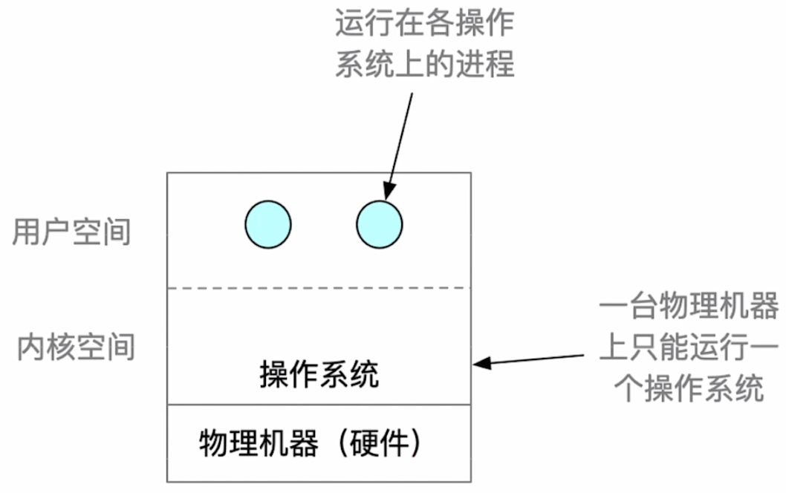
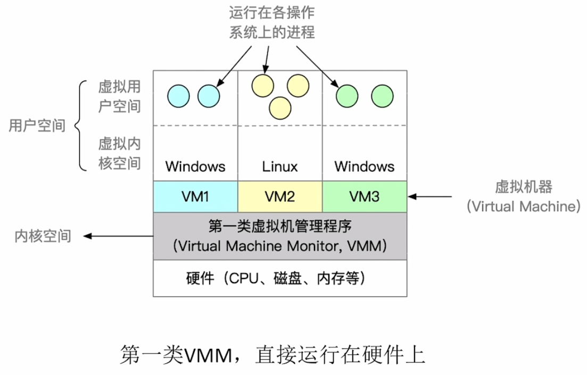
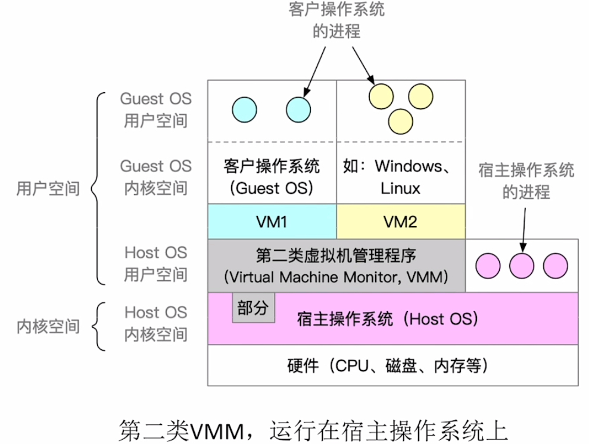
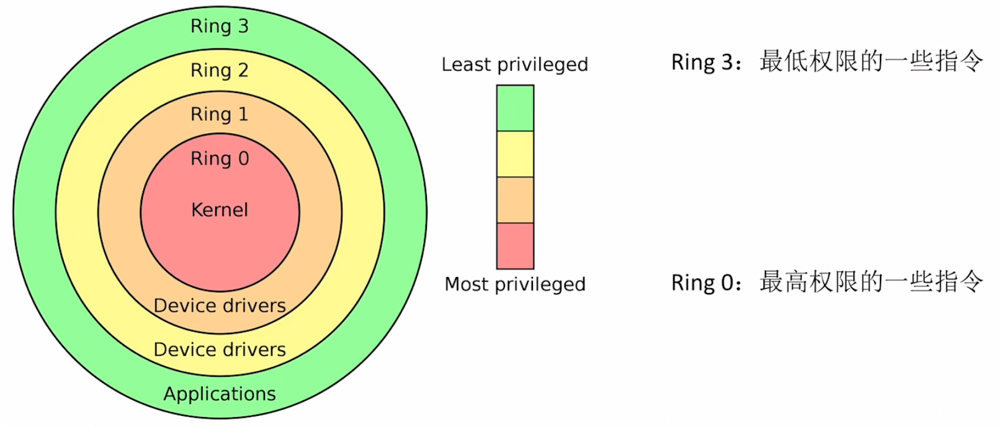

# 虚拟机（常考选择题）

### **日期**: 2024 年 10 月 19 日

---

### 知识总览

- 两种虚拟机

---

## **传统计算机**

- ### **一台物理机器只能运行一个操作系统**

## **虚拟机**

- ### **虚拟机**：使用虚拟化技术，将一台物理机器虚拟化为多台虚拟器（Virtual Machine, VM），每个虚拟机都可以独立运行一个操作系统
- ### **同义术语**：虚拟机管理程序（Virtual Machine Monitor, VMM）/虚拟机监控程序（Hypervisor）

- ### **第一类虚拟机管理程序**：直接运行在硬件之上

  

  - ### **单核 CPU**：划分 CPU 时间片分给多个虚拟机
  - ### **特权指令**：虚拟机管理程序截获特权指令，并执行相应的虚拟化操作

- ### **第二类虚拟机管理程序**：运行在宿主操作系统上

  

- ### **常见虚拟机软件**：VirtualBOX、VMware（都是第二类虚拟机管理程序）

## **两类虚拟机管理程序（VMM）的对比**

| 特点               | 第一类 VMM                                                                                             | 第二类 VMM                                                                                                            |
| ------------------ | ------------------------------------------------------------------------------------------------------ | --------------------------------------------------------------------------------------------------------------------- |
| 对物理资源的控制权 | 直接运行在硬件之上，能直接控制和分配物理资源                                                           | 运行在 Host OS 之上，依赖于 Host OS 为其分配物理资源                                                                  |
| 资源分配方式       | 在安装 Guest OS 时，VMM 要在原本的硬盘上自行分配存储空间，类似于"外核"的分配方式，分配未抽象的物理硬件 | GuestOS 拥有自己的虚拟磁盘，该盘实际上是 Host OS 文件系统中的一个大文件。GuestOS 分配到的内存是虚拟内存               |
| 性能               | 性能更好                                                                                               | 性能更差，需要 HostOS 作为"中介"                                                                                      |
| 可支持的虚拟机数量 | 更多，不需要和 Host OS 竞争资源，相同的硬件资源可以支持更多的虚拟机                                    | 更少，Host OS 本身需要使用物理资源，Host OS 上运行的其他进程也需要物理资源                                            |
| 虚拟机的可迁移性   | 更差                                                                                                   | 更好，只需导出虚拟机镜像文件即可迁移到另一台 HostOS 上，商业化应用更广泛                                              |
| 运行模式           | 第一类 VMM 运行在最高特权级（Ring 0），可以执行最高特权的指令。                                        | 第二类 VMM 部分运行在用户态、部分运行在内核态。GuestOS 发出的系统调用会被 VMM 截获，并转化为 VMM 对 HostOS 的系统调用 |

- ### **支持虚拟化的 CPU 通常分更多指令等级**
  
  - **可以将不同的指令级别合理分配**
