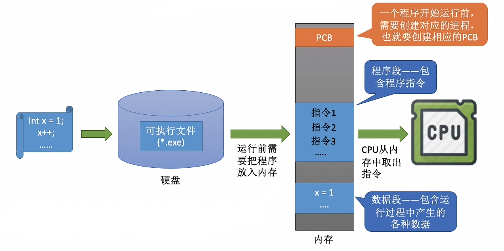
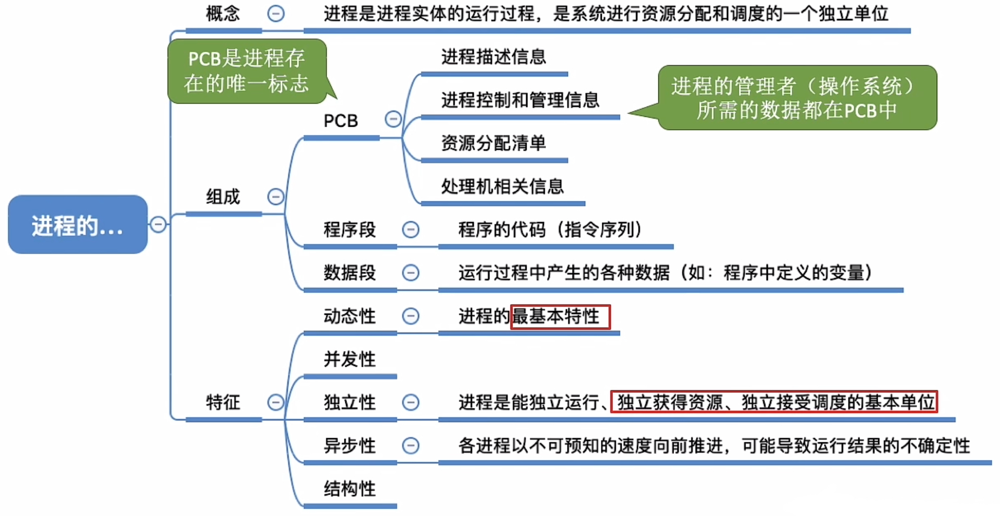

# 进程的概念、组成、特征

### **日期**: 2024 年 10 月 19 日

---

### 知识总览

- 进程的
  - 概念
    - 理解“进程”和“程序”的区别
  - 组成
    - 一个进程由哪些部分组成
  - 特征
    - 进程有哪些重要的特征

---

## **进程的概念**

- ### **打开 1 个 TIM**
  
- ### **打开 2 个 TIM**
  
- ### **程序**：是**静态的**，就是整个存放在磁盘里的可执行文件，就是一系列的指令集合
- ### **进程（Process）**：是**动态的**，是程序的一次执行过程
  - 同一个程序多次执行会对应多个进程
- ### **思考**：操作系统是这些进程的管理者，它要怎么区分各个进程？

## **进程的组成——PCB**

- ### **进程标识符（Process ID, PID）**：操作系统给每个进程分配一个**唯一的、不重复的**标识符，用来区分不同的进程
- ### **操作系统要记录 PID、进程所属用户 ID(UID)**，这些都是基本的进程描述信息，可以**让操作系统区分各个进程**
- ### **操作系统还要记录给进程分配了哪些资源**，比如分配了多少内存、正在使用哪些 I/O 设备、正在使用哪些文件，可以用于**实现操作系统对系统资源的管理**
- ### **还要记录进程的运行情况**，比如 CPU 使用时间、磁盘使用情况、网络流量使用情况等，可以用于**实现操作系统对进程的控制、调度**
- ### 以上信息都被保存在一个数据结构**PCB**（Process Control Block）中，**即进程控制块**
- ### 操作系统需要对各个并发运行的进程进行管理，**但凡管理时所需要的信息，都会被放在 PCB 中**

## **进程控制块 PCB**

- ### **进程描述信息**
  - **进程标识符 PID**
  - **用户标识符 UID**
- ### **进程控制和管理信息**
  - **CPU、磁盘、网络流量使用情况统计...**
  - **进程当前状态：就绪态/阻塞态/运行态...**
- ### **资源分配清单**
  - **正在使用哪些文件**
  - **正在使用哪些内存区域**
  - **正在使用哪些 I/O 设备**
- ### **处理机相关信息**

  - **如 PSW、PC 等各种寄存器的值（用于实现进程切换）**

- ### **<u>PCB 是进程存在的唯一标志，当进程被创建时，操作系统为其创建 PCB，当进程结束时，会回收其 PCB</u>**

- ### **<u>操作系统对进程进行管理工作所需的信息都存在 PCB 中</u>**

## **进程的组成——PCB、程序段、数据段**

- ### **PCB**
  - **进程描述信息**
  - **进程控制和管理信息**
  - **资源分配清单**
  - **处理机相关信息**
- ### **程序段**：程序的代码（指令序列）
- ### **数据段**：运行过程中产生的各种数据（如：程序中定义的变量）

- ### **PCB 是<u>给操作系统用的</u>**

- ### **程序段、数据段是<u>给进程自己用的</u>**

- ### **进程**是进程实体的**运行过程**，是系统进行**资源分配**和**调度**的一个独立单位
  - 一个进程被“**调度**”，就是指操作系统决定让这个进程上 CPU 运行（后续详细学习）
- ### **<u>更准确来说</u>**，前面的 **PCB、程序段、数据段**三部分组成了**进程实体**（**进程映像**），但除非<u>**题目特别考察**</u>，否则都可以把进程和进程实体等同

- ### 同一程序的不同进程的 **PCB、数据段各不相同**，但它们**程序段的内容是相同的**（以 TIM 为例则都是运行相同的 TIM 程序）

## **程序是如何运行的？**

- ### 一个**进程实体（进程映像）由 PCB、程序段、数据段组成**
- ### **进程**是**动态**的，而**进程实体（进程映像）是静态的**
- ### **进程实体**反映了**进程**在某一时刻的**状态**

## **进程的特征**

### 程序是静态的，进程是动态的，相比于程序，进程拥有以下特征：

- ### **动态性**：进程是程序的一次执行过程，是动态地产生、变化和消亡的
  - **动态性**是进程最基本的特征
- ### **并发性**：内存中有多个进程实体，各进程可并发执行
- ### **独立性**：进程是能独立运行、独立获得资源、独立接受调度的基本单位
- ### **异步性**：各进程按各自独立的、不可预知的速度向前推进，操作系统要提供“进程同步机制”来解决异步问题
  - **异步性**会导致并发程序执行结果的不确定性。具体会在“进程同步”相关小节进行学习
- ### **结构性**：每个进程都会配置一个 PCB。结构上看，进程由程序段、数据段、PCB 组成

---

## 知识回顾与重要考点\*\*

- ### **注意**：引入“**线程**”概念后，进程就不再是**接受调度的基本单位**，但依然是**独立获得资源的基本单位**，后续还会具体学习
