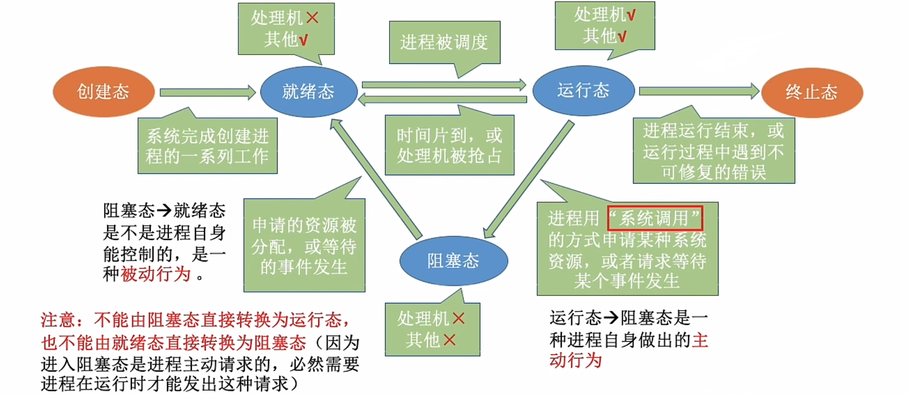
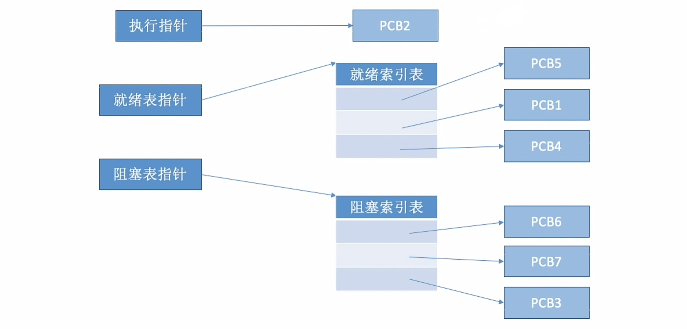

# 进程的状态与转换&进程的组织

### **日期**: 2024 年 10 月 20 日

---

### 知识总览

- 进程的状态与转换
  - 状态
    - 运行状态---|
    - 就绪状态---|---三种基本状态（**重要考点**）
    - 阻塞状态---|
    - 创建状态
    - 终止状态
  - 状态间的转换（**重要考点**）
    - 就绪态 $\to$ 运行态
    - 运行态 $\to$ 就绪态
    - 运行态 $\to$ 阻塞态
    - 阻塞态 $\to$ 就绪态
  - 进程的组织方式（各个 PCB 进程的组织方式）

---

## **进程的状态——创建态、就绪态**

- ### **创建态**：进程正在被创建时，它的状态是“**创建态**”，在这个阶段操作系统会为进程分配资源、初始化**PCB**
- ### **就绪态**：当进程创建完成后，便进入“**就绪态**”，处于就绪态的进程已经具备运行条件，但由于没有空闲 CPU，就暂时不能运行

## **进程的状态——运行态**

- ### 系统中可能会有很多个进程都处于就绪态
- ### **运行态**：当 CPU 空闲时，操作系统就会选择一个就绪程序，让它上处理机运行。如果一个进程此时正在 CPU 上运行，那么这个进程处于“运行态”
- ### CPU 会执行运行态进程对应的程序（执行指令序列）

## **进程的状态——阻塞态**

- ### 在进程运行的过程中，可能会**请求等待某个事件的发生**（如等待某种系统资源的分配，或者等待其他进程的响应）
- ### **阻塞态**：在这个事件发生之前，进程无法继续往下执行，此时操作系统会让这个进程下 CPU，并让它进入“**阻塞态**”
- ### 当 CPU 空闲时，又会选择另一个“就绪态”进程上 CPU 运行
- ### 当阻塞进程所等待的事件发生时，操作系统会检查等待队列，寻找需要这件事情发生的**阻塞态进程**，并将其中的一个**转为就绪态**

## **进程的状态——终止态**

- ### 一个进程可以执行 exit 系统调用，请求操作系统终止该进程
- ### **终止态**：此时该进程会进入“**终止态**”，操作系统会让该进程下 CPU，并回收内存空间等资源，最后还要回收该进程的 PCB

## **进程状态的转换**（重要考点）

- ### **注意**：在单核 CPU 中，同一时间内最多有一个进程处于运行态

## **进程的状态**

- ### **三种基本状态**：进程的整个生命周期中，大部分时间都处于三种基本状态
  - **运行态（Running）**：占有 CPU，并在 CPU 上运行
  - **就绪态（Ready）**：已经具备运行条件，但由于没有空闲 CPU，所以暂时不能运行
  - **阻塞态（Waiting/Blocked，又称等待态）**：因等待某一事件发生而暂时不能运行
- ### **另外两种状态**
  - **创建态（New，又称新建态）**：进程正在被创建，操作系统为进程分配资源、初始化 PCB
  - **终止态（Terminated，又称结束态）**：进程正在从系统中撤销，操作系统会回收进程拥有的资源、撤销 PCB
- ### **进程 PCB 中，会有一个变量 state 来表示进程的当前状态**。如 1 表示创建态、2 表示就绪态、3 表示运行态……
- ### 为了对同一个状态下的各个进程进行统一的管理，操作系统会将各个进程的 PCB 组织起来

---

## **进程的组织方式——链接方式**

- ### **执行指针**：指向当前处于**运行态**（执行态）的进程
  - ### 单 CPU 计算机中，同一时刻只会有一个进程处于运行态
- ### **就绪队列指针**：指向当前处于**就绪态**的进程
  - ### 通常会把优先级高的进程放在队头
- ### **阻塞队列指针**：指向当前处于**阻塞态**的进程
  - ### 很多操作系统还会根据阻塞原因不同，再分为**多个阻塞队列**，例如：等待打印机的阻塞队列、等待磁盘的阻塞队列

## **进程的组织方式——索引方式**

## **进程的组织方式总结**
- ### **链接方式**
    - **按照进程状态将PCB分为多个队列**
    - **操作系统持有指向各个队列的指针**
- ### **索引方式**
    - **根据进程状态的不同，建立几张索引表**
    - **操作系统持有指向各个索引表的指针**
