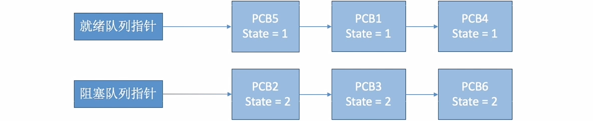
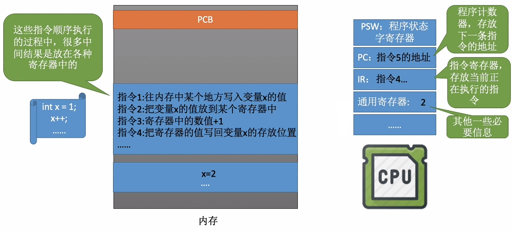

# 进程控制

### **日期**: 2024 年 10 月 20 日

---

### 知识总览

- 进程控制
  - 基本概念
    - 什么是进程控制？
    - 如何实现进程控制？
      - 用“原语”实现
  - 进程控制相关的原语
    - 进程的创建
    - 进程的终止
    - 进程的阻塞
    - 进程的唤醒
    - 进程的切换

---

## **什么是进程控制？**

- ### **进程控制**：进程控制的主要功能是对系统中的所有进程实施有效的管理，它具有创建新进程、撤销已有进程、实现进程状态转换等功能
- ### **简单理解**：进程控制的目的就是实现进程状态转换

## **如何实现进程控制？**

- ### 用“原语”实现
- ### **原语**：存在于操作系统内核（或微内核）中的一种特殊程序，它的**执行具有原子性**。也就是说，这段程序的**运行必须一气呵成，不可中断**
- ### **思考**：为何进程控制（状态转换）的过程要“一气呵成”？
  - **e.g.** 假设 PCB 中的变量 state 表示当前进程所处状态，1 表示就绪态，2 表示阻塞态...
    
  - 假设此时进程 2 等待的事件发生，则操作系统中，负责进程控制的内核程序至少需要做这样两件事：
    1. 将 PCB2 的 state 设为 1
    2. 将 PCB2 从阻塞队列放到就绪队列
    - 假设在这两步之间发生了中断，那么 PCB2 的 state 为 1，但它却被放在阻塞队列里
- ### **原因**：如果不能“一气呵成”就有可能导致操作系统中的某些关键数据结构信息不统一的情况，这会影响操作系统进行别的管理工作

## **如何实现原语的“原子性”？**

- ### **原语**具有**原子性**，即执行过程只能一气呵成，期间**不允许被中断**
- ### 可以用**关中断指令**和**开中断指令**这两个**特权指令**实现**原子性**
- ### **正常情况**：CPU 每执行完一条指令都会例行检查是否有中断信号需要处理，如果有，则暂停运行当前这段程序，转而执行相应的中断处理程序
- ### **关中断指令**：CPU 执行了**关中断指令**之后，就不再例行检查中断信号，直到执行**开中断指令**之后才会恢复检查
  - **注**：在关中断指令和开中断指令中间传来的外部中断信号，都会留到开中断指令之后被检测并处理
- ### **原子性的实现**：关中断、开中断之间的这些指令就是不可被中断的，这就实现了“**原子性**”
- ### **思考**：如果这两个指令允许用户程序使用，会发生什么情况？

---

## **进程控制相关的原语**

- ### **进程的创建**

  - **创建原语**：操作系统创建一个进程时使用的原语
    - 申请空白 PCB
    - 为新进程分配所需资源
    - 初始化 PCB
    - 将 PCB 插入就绪队列：**创建态 $\to$ 就绪态**
  - **引起进程创建的事件**
    - 用户登录：分时系统中，用户登录成功，系统会为其建立一个新的进程
    - 作业调度：多道批处理系统中，有新的作业放入内存时，会为其建立一个新的进程
    - 提供服务：用户向操作系统提出某些请求时，会新建一个进程处理该请求
    - 应用请求：由用户进程主动请求创建一个子进程

- ### **进程的终止**

  - **撤销原语**：**就绪态/阻塞态/运行态 $\to$ 终止态 $\to$ 无**
    - 从 PCB 集合中找到终止进程的 PCB
    - 若进程正在运行，立即剥夺 CPU，将 CPU 分配给其他进程
    - **终止其所有子进程**（进程间的挂你是树形结构）
    - 将该进程所拥有的所有资源归还给父进程或操作系统
    - 删除 PCB
  - **引起终止进程的事件**
    - **正常结束**：进程自己请求终止（exit 系统调用）
    - **异常结束**：整数除 0、非法使用特权指令然后被操作系统强行杀掉等非法行为导致的结束
    - **外界干预**：Ctrl+Alt+delete，用户选择杀掉进程

- ### **进程的阻塞**

  - **阻塞原语**：**运行态 $\to$ 阻塞态**
    - 找到要阻塞的进程对应的 PCB
    - 保护进程运行现场，将 PCB 状态信息设置为“阻塞态”，暂时停止进程运行
    - 将 PCB 插入相应事件的等待队列
  - **引起进程阻塞的事件**
    - 需要等待系统分配某种资源
    - 需要等待相互合作的其他进程完成工作

- ### **进程的唤醒**

  - **唤醒原语**：**阻塞态 $\to$ 运行态**
    - 在事件等待队列中找到 PCB
    - 将 PCB 从等待队列移除，设置进程为“就绪态”
    - 将 PCB 插入就绪队列，等待被调度
  - **引起进程唤醒的事件**
    - 等待的事件发生：**因何事阻塞，就应因何事唤醒**

- ### **进程的切换**
  - **切换原语**：**运行态$\leftrightarrow$就绪态**
    - 将运行环境信息存入 PCB
    - PCB 移入相应队列
    - 选择另一个进程执行，并更新其 PCB
    - 根据 PCB 恢复新进程所需的运行环境
  - **引起进程切换的事件**
    - 当前进程时间片到
    - 有更高优先级的进程到达
    - 当前进程主动阻塞
    - 当前进程终止
- ### **无论是哪个进程控制的原语，要做的无非三类事情**：
  1. **更新 PCB 中的信息**：修改进程状态（state），保存/恢复运行环境
  2. **将 PCB 插入相应的队列**
  3. **分配/回收资源**

## **程序是如何运行的？**

- ### **思考**：执行完指令 3 后，另一个进程开始上 CPU 运行，会发生什么？
  - **注意**：另一个进程在运行过程中也会使用各个寄存器，会覆盖前一个进程的中间结果
- ### **解决方法**：将原来的进程的运行环境存入 PCB（需要的寄存器的内容），当原来的进程再次投入运行时，可以**通过 PCB 恢复它的运行情况**
